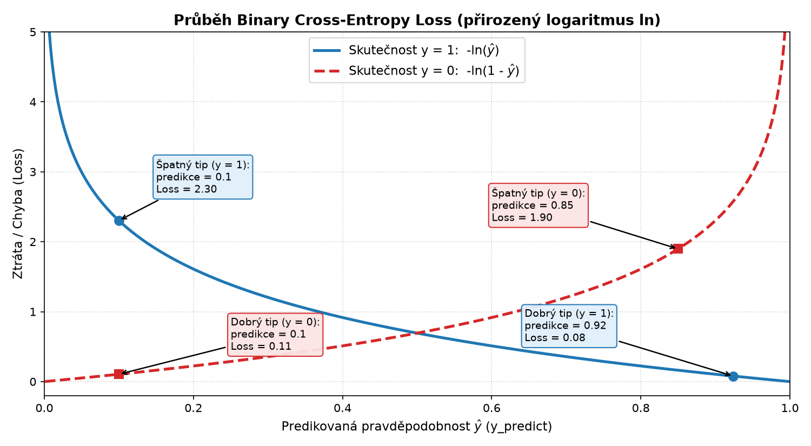

# Opakování vybraných částí o neuronových sítích a optimalizace

Tento přehled propojuje 4 praktické ukázky, které krok za krokem vysvětlují vybrané části neuronových sítí až po model v knihovně PyTorch:

* **Cíl trénování a minimalizace chyby:** Během trénování hledáme takové parametry (váhy), při kterých je hodnota chybové funkce co nejmenší. K hledání minima funkce nám v 1D prostoru pomáhá derivace. V neuronových sítích však pracujeme ve vícerozměrném prostoru, a proto místo prosté derivace používáme **gradient** (vektor parciálních derivací podle všech vah).
* **Optimalizace pomocí gradientního sestupu (`sgd-example.py`):** V ukázce hledáme minimum funkce pomocí základního gradientního sestupu (Gradient Descent, GD). U běžných neuronových sítí nemáme praktický obecný analytický vzorec pro nalezení optimálních parametrů, proto používáme numerickou optimalizaci. Při práci s daty se pak přechází od výpočtu přes celý dataset k náhodným dávkám (*minibatches*) – odtud označení *stochastický* gradientní sestup (SGD).
* **Měření chyby (`loss-example.py`):** Abychom měli co minimalizovat, potřebujeme ztrátovou funkci (*Loss function*), která síti přesně řekne, jak velké chyby v predikci se dopustila. Pro regresi používáme střední kvadratickou chybu (MSE), pro binární klasifikaci binární křížovou entropii (BCELoss) a pro více tříd CrossEntropyLoss.
* **Jeden neuron od základu (`nn-from-scratch-pytorch.py`):** Ukazuje mechaniku základního perceptronu. Funkce `forward` provádí vážený součet vstupů a přičtení posunutí ($X \cdot w + b$) – sčítání je schované přímo v maticovém násobení jako skalární součin jednotlivých řádků matice vstupů s vektorem vah. Výpočet chyby pomocí `torch.mean((y - o)**2)` představuje MSE ztrátovou funkci pro regresi.
* **Ucelený model v PyTorch (`nn-simple-classification-model.py`):** Spojuje předchozí principy do funkčního celku a demonstruje standardní zápis vrstev v PyTorch (`nn.Sequential`), nelineární aktivační funkce a kompletní trénovací smyčku pro klasifikaci.

---

## 1. Optimalizace a gradientní sestup (Gradient Descent vs. SGD)

Cílem trénování neuronové sítě je nalézt takové hodnoty parametrů (vah a posunutí), při kterých je chyba modelu co nejmenší.

### Základní principy:
* **Hledání minima:** Chybovou funkci si lze představit jako krajinu (*loss landscape*). Hledáme bod, kde má tato funkce nejmenší hodnotu (lokální či globální minimum).
* **Derivace (1D):** Určuje sklon funkce v daném bodě. V minimu funkce je derivace rovna nule ($f'(x) = 0$).
* **Gradient (více rozměrů):** Protože neuronová síť má tisíce až miliony parametrů, používáme **gradient** – vektor parciálních derivací podle všech parametrů. Gradient ukazuje směr nejstrmějšího růstu funkce, proto se posouváme v jeho protisměru (**sestup**):
  $$w_{nové} = w_{staré} - \alpha \cdot \nabla \text{Loss}(w)$$
  kde $\alpha$ je rychlost učení (*learning rate*) a $\nabla \text{Loss}(w)$ je gradient ztrátové funkce podle vah.
* **Analytické vs. numerické řešení:**
  - U běžných neuronových sítí nemáme praktický obecný analytický vzorec pro nalezení optimálních parametrů, proto používáme numerickou optimalizaci (postupné malé kroky směrem dolů).
* **Rozdíl: GD $\rightarrow$ Mini-batch GD $\rightarrow$ SGD:**
  - V ukázce `sgd-example.py` se ve skutečnosti jedná o **klasický Gradient Descent (GD)** – máme jeden bod $x$ a přímo počítáme přesnou derivaci funkce $f(x)$.
  - **Batch Gradient Descent:** Při trénování na datech by to znamenalo spočítat gradient přes celý trénovací dataset najednou. To je výpočetně a paměťově velmi náročné.
  - **Mini-batch Gradient Descent:** V praxi se gradient odhaduje vždy z menší náhodné dávky dat (**minibatch**). Minibatch gradient navíc přidává do optimalizace určitý šum, který může ovlivnit dynamiku učení a někdy pomoci při průchodu složitým *loss landscape*.
  - **SGD (Stochastic Gradient Descent):** Původně označoval výpočet gradientu z jediného vzorku, dnes se však zkratka **SGD** (např. v PyTorch třída `torch.optim.SGD`) běžně používá jako souhrnné označení pro celou tuto rodinu metod pracujících s dávkami.

### Analytický vs. numerický příklad:
U jednoduché funkce $f(x) = x^2 - 6x + 1$:
* **Analyticky:** Derivace je $f'(x) = 2x - 6$. Položíme $2x - 6 = 0 \implies \mathbf{x = 3}$ (bod minima). Funkční hodnota je $f(3) = 3^2 - 6(3) + 1 = \mathbf{-8}$.
* **Numericky (SGD):** Níže uvedený skript začíná na bodě $x = 15$ a krok za krokem konverguje k $x = 3$.

### Zdrojový kód: Hledání minima funkce pomocí GD (`sgd-example.py`)

```python
import numpy as np
import matplotlib.pyplot as plt

plt.ion()

# Definice 1D funkce a její analytické derivace
def fx(x):
    return x**2 - 6*x + 1

def deriv(x):
    return 2*x - 6 

x = np.linspace(-14, 20, 2000)

# Výchozí bod (parametr, který chceme optimalizovat)
localmin = 15.0 
print("Výchozí bod localmin:", localmin)

plt.plot(x, fx(x), label="f(x)")
plt.plot(localmin, fx(localmin), 'ro', label="Start")
plt.legend()
plt.show()
plt.pause(1)

learning_rate = 0.1
training_epochs = 50

for i in range(training_epochs):
    grad = deriv(localmin)
    move = learning_rate * grad
    localmin = localmin - move
    
    print(f"Epoch {i}: grad={grad:.4f}, localmin={localmin:.4f}, f(x)={fx(localmin):.4f}")
    
    plt.plot(localmin, fx(localmin), 'go')
    plt.show()
    plt.pause(0.05)  # krátká pauza pro plynulou animaci

print(f"\nVýsledné nalezené minimum: x = {localmin:.4f}, f(x) = {fx(localmin):.4f}")
plt.savefig("sgd_out.png")
```

---

## 2. Ztrátové funkce (Loss Functions)

Ztrátová funkce určuje penalizaci za odchylku predikce sítě od skutečné hodnoty. Volba závisí na typu řešeného problému.

### A. Regrese: MSELoss (Mean Squared Error)
Používá se pro spojité číselné hodnoty (např. odhad ceny, teploty):
$$MSE = \frac{1}{N} \sum_{i=1}^{N} (y_i - \hat{y}_i)^2$$

### B. Binární klasifikace: BCELoss (Binary Cross-Entropy)
Používá se, pokud vybíráme mezi dvěma třídami ($y \in \{0, 1\}$).

Vzorec:
$$L = - \big[ y \cdot \log(\hat{y}) + (1 - y) \cdot \log(1 - \hat{y}) \big]$$

Vzorec funguje jako **přepínač** podle skutečné třídy $y$:
* **Pokud je $y = 1$:** Část $(1 - y)$ je $0$. Zbývá pouze $-\log(\hat{y})$. Pokud síť předpoví $1$, chyba je $0$. Pokud předpoví $0$, chyba je obrovská.
* **Pokud je $y = 0$:** Část $y$ je $0$. Zbývá pouze $-\log(1 - \hat{y})$. Pokud síť předpoví $0$, chyba je $0$. Pokud předpoví $1$, chyba je obrovská.

> **Poznámka:** $\log$ ve strojovém učení (např. v PyTorch knihovně) zpravidla znamená **přirozený logaritmus** ($\ln$, se základem $e$).



V grafu jsou vyznačeny obě situace a konkrétní hodnoty:
* **Modrá křivka:** (skutečnost $y = 1$, funkce ${-\ln(\hat{y})}$)
  - **Špatný tip ($\hat{y} = 0.1$):** Ztráta je vysoká: $-\ln(0.1) \approx 2.30$ (příklad z `loss-example.py`).
  - **Dobrý tip ($\hat{y} = \sigma(2.5) \approx 0.92$):** Po aplikaci Sigmoidu ztráta klesne k nule: $-\ln(0.92) \approx 0.08$.
* **Červená čárkovaná křivka**(skutečnost $y = 0$, funkce ${-\ln(1 - \hat{y})}$): 
  - **Dobrý tip ($\hat{y} = 0.1$):** Když je skutečnost $0$ a síť tipne $0.1$, chyba je minimální: $-\ln(1 - 0.1) \approx 0.11$.
  - **Špatný tip ($\hat{y} = 0.85$):** Když síť mylně předpoví vysokou pravděpodobnost $0.85$, chyba prudce roste: $-\ln(1 - 0.85) \approx 1.90$.

#### Důležité rozlišení: Logit $\rightarrow$ Sigmoid $\rightarrow$ Pravděpodobnost vs. BCEWithLogitsLoss

Model může interně produkovat libovolné reálné číslo (**logit** v rozsahu $-\infty$ až $+\infty$). Sigmoid z něj udělá hodnotu $0$ až $1$, která se interpretuje jako pravděpodobnost. 

V PyTorch máme dvě cesty:
1. **Sigmoid + `nn.BCELoss()`**
2. **Pouze `nn.BCEWithLogitsLoss()` (doporučeno)**:
   `BCEWithLogitsLoss` v sobě Sigmoid i logaritmus zahrnuje přímo v jednom matematickém kroku a je numericky stabilnější.

### C. Vícetřídní klasifikace: CrossEntropyLoss
Kombinuje funkci `LogSoftmax` a `NLLLoss` (Negative Log-Likelihood).
* `Softmax` převede neomezené výstupy (logits) na pravděpodobnostní rozdělení (součet = 1).
* `CrossEntropyLoss` penalizuje nízkou pravděpodobnost přiřazenou správné třídě.

### Zdrojový kód: Ukázky ztrátových funkcí (`loss-example.py`)

```python
import torch
import torch.nn as nn
import numpy as np

print("Pro regresi: MAE, MSE")
print("Pro klasifikaci: BCELoss, BCEWithLogitsLoss, CrossEntropyLoss\n")

### 1. MSELoss (Regrese)
print("------ MSELoss ------")
y_predict = torch.tensor(2.5)
y_real = torch.tensor(0.2)

loss_mse = nn.MSELoss()
loss_mse_out = loss_mse(y_predict, y_real)
print("y_predict:", y_predict)
print("y_real:", y_real)
print("loss_mse_out:", loss_mse_out)

### 2. BCELoss (Binární klasifikace)
print("\n------ BCELoss ------")
loss_bce = nn.BCELoss()
y_predict = torch.tensor(0.1)
y_real = torch.tensor(1.0)
loss_bce_out = loss_bce(y_predict, y_real)
print("loss_bce_out (špatný tip):", loss_bce_out)

# Sigmoid + BCELoss pro surový výstup (logit)
sigm = nn.Sigmoid()
y_predict_raw = torch.tensor(2.5)
y_predict_prob = sigm(y_predict_raw)
loss_sigm_bce = loss_bce(y_predict_prob, y_real)
print("loss_sigm_bce_out:", loss_sigm_bce)

### 3. BCEWithLogitsLoss (Kombinace Sigmoid + BCELoss v jednom)
print("\n------ BCEWithLogitsLoss ------")
loss_bcewl = nn.BCEWithLogitsLoss()
loss_bcewl_out = loss_bcewl(y_predict_raw, y_real)
print("loss_bcewl_out:", loss_bcewl_out)

### 4. CrossEntropyLoss (Vícetřídní klasifikace)
print("\n------ CrossEntropyLoss ------")
loss_cel = nn.CrossEntropyLoss()
y_predict = torch.tensor([1.5, 3.0, 4.0])  # Logity pro 3 třídy (nejvyšší pro třídu 2)

# Pokud je správná třída 0 (model jí věří nejméně -> velká chyba)
print("loss_cel_out pro třídu 0:", loss_cel(y_predict, torch.tensor(0)))
# Pokud je správná třída 2 (model jí věří nejvíce -> malá chyba)
print("loss_cel_out pro třídu 2:", loss_cel(y_predict, torch.tensor(2)))

### 5. Softmax princip
print("\n------ Softmax ------")
soft_max = nn.Softmax(dim=0)
in_val = torch.FloatTensor([1.0, 4.0, 3.0])
out_soft = soft_max(in_val)
print("Vstupní hodnoty:", in_val)
print("Pravděpodobnosti po Softmax:", out_soft, "Součet:", out_soft.sum().item())
```

---

## 3. Jeden neuron od základu (Perceptron)

### Co vlastně znamenají váhy a posunutí (bias)?
Vstupní data obsahují jednotlivé příznaky (*features*, např. souřadnice bodu, plocha, barva).
* **Váhy ($w$):** Každému příznaku neuron přiřadí váhu, která určuje jeho důležitost a vliv na výsledek (kladná váha výstup zvyšuje, záporná snižuje).
* **Posunutí ($b$, bias):** Určuje posun rozhodovací hranice (práh citlivosti neuronu), tedy jak snadno se neuron aktivuje i při nulových vstupech.

Schéma jednoho konkrétního neuronu:
```text
x1 ── w1 ──┐
x2 ── w2 ──┼──> x1·w1 + x2·w2 + x3·w3 + b ──> aktivace ──> výstup
x3 ── w3 ──┘
```

Když v PyTorch později definujeme například `nn.Linear(2, 4)`, znamená to jednoduše **4 takové neurony**, přičemž každý z nich má 2 vstupy.

### Matematický zápis a maticové násobení
Jeden neuron provádí vážený součet vstupů a přičítá práh (bias):
$$o = X \cdot w + b$$

* **Skalární součin:** Operace `torch.matmul(X, w)` je maticové násobení. Pro každý řádek (vzorek) matice $X$ provede skalární součin vstupních příznaků s váhami $w$. Součet je tedy schován přímo v násobení.
* **Autograd v PyTorch:** Parametr `requires_grad=True` říká knihovně PyTorch, aby sledoval operace s tenzorem a automaticky spočítal parciální derivace při zavolání `loss.backward()`.
* **Krok optimalizátoru:** `optim.step()` odečte gradienty vynásobené rychlostí učení od parametrů ($w \leftarrow w - \alpha \cdot \nabla \text{Loss}$).

### Zdrojový kód: Trénování jednoho neuronu (`nn-from-scratch-pytorch.py`)

```python
import torch
import torch.nn as nn
import torch.optim as optim

# Dopředný průchod (Forward pass): vážený součet + bias
def forward(X, w, b):
    return torch.matmul(X, w) + b 

# Náhodná inicializace parametrů s požadavkem na sledování gradientů
w = torch.rand(1, 1, requires_grad=True)
b = torch.rand(1, 1, requires_grad=True)

# Trénovací data (vstup X, požadovaný výstup y)
X = torch.tensor([[1.0], [0.3], [0.5], [0.7]], dtype=torch.float)
y = torch.tensor([[0.95], [0.51], [0.65], [0.87]], dtype=torch.float)

epochs = 100
learning_rate = 0.01
optimizer = optim.SGD([w, b], lr=learning_rate)

for epoch in range(epochs):
    # 1. Dopředný průchod
    o = forward(X, w, b)
    
    # 2. Výpočet ztráty (MSE)
    loss = torch.mean((y - o)**2)
    
    # 3. Zpětný průchod (výpočet gradientů)
    loss.backward()
    
    # 4. Aktualizace parametrů (což odpovídá w -= w.grad * lr)
    optimizer.step()
    
    # 5. Vynulování gradientů pro další iteraci
    optimizer.zero_grad()
    
    if (epoch + 1) % 10 == 0:
        print(f"Epoch {epoch + 1}/{epochs}, Loss: {loss.item():.4f}")

print(f"\nNaučené parametry: w = {w.item():.4f}, b = {b.item():.4f}")
```

---

## 4. Kompletní klasifikační model v PyTorch

V reálných úlohách se komponenty neprogramují ručně, ale skládají se pomocí knihovny `torch.nn`.

### Typický pipeline:
1. **Definice modelu (`nn.Sequential`):**
   - `nn.Linear(in_features, out_features)`: Lineární vrstva ($X \cdot W^T + b$).
   - `nn.ReLU()`: Nelineární aktivační funkce (${f(x) = \max(0, x)})$ umožňující síti učit se nelineární vztahy.
   - `nn.Sigmoid()`: Převádí výstup do intervalu $(0, 1)$ vhodného pro pravděpodobnost třídy.
2. **Výběr loss funkce a optimizeru:** `nn.BCELoss()` a `optim.SGD()`.
3. **Trénovací smyčka:** Forward $\rightarrow$ Loss $\rightarrow$ Backward $\rightarrow$ Step $\rightarrow$ Zero Grad.
4. **Predikce:** Vyhodnocení výstupu prahováním (např. $p > 0.5$).

### Zdrojový kód: Klasifikační síť na syntetických datech (`nn-simple-classification-model.py`)

```python
import torch
import numpy as np
import torch.nn as nn
import torch.optim as optim
import matplotlib.pyplot as plt

# 1. Příprava syntetických 2D dat pro 2 třídy
np.random.seed(42)
A = [1, 1]  # Střed třídy 0
B = [5, 1]  # Střed třídy 1

a = [A[0] + np.random.randn(100), A[1] + np.random.randn(100)]
b = [B[0] + np.random.randn(100), B[1] + np.random.randn(100)]

ya = np.zeros((100, 1))
yb = np.ones((100, 1))

labels = np.vstack((ya, yb))
data = np.hstack((a, b)).T

x = torch.tensor(data).float()
y = torch.tensor(labels).float()

# 2. Definice architektury sítě
model = nn.Sequential(
    nn.Linear(2, 4),   # 2 vstupy -> 4 neurony ve skryté vrstvě
    nn.ReLU(),         # Nelineární aktivace
    nn.Linear(4, 1),   # 4 neurony -> 1 výstup
    nn.Sigmoid()       # Pravděpodobnost třídy (0 až 1)
)

print("Architektura modelu:")
print(model)

# 3. Ztrátová funkce a optimalizátor
loss_fn = nn.BCELoss()
optimizer = optim.SGD(model.parameters(), lr=0.05)

# 4. Trénovací smyčka
epochs = 500
train_losses = torch.zeros(epochs)

for epoch in range(epochs):
    pred = model(x)
    loss = loss_fn(pred, y)
    train_losses[epoch] = loss.item()
    
    loss.backward()
    optimizer.step()
    optimizer.zero_grad()

# 5. Zobrazení vývoje chyby
plt.figure(figsize=(8, 4))
plt.plot(train_losses.detach(), label="Trénovací ztráta")
plt.xlabel("Epocha")
plt.ylabel("Loss")
plt.title("Průběh trénování")
plt.legend()
plt.show()

# 6. Vyhodnocení predikce
predictions = model(x)
predicted_classes = (predictions > 0.5).float()
accuracy = (predicted_classes == y).float().mean()
print(f"\nPřesnost modelu: {accuracy.item() * 100:.2f} %")
```

---

## 5. Shrnutí: 5 kroků trénovací smyčky

V každé epoše se v PyTorch opakuje stejný cyklus:

| Krok | Kód | Význam |
|---|---|---|
| **1. Forward pass** | `pred = model(x)` | Síť spočítá výstup pro zadaný vstup |
| **2. Loss computation** | `loss = loss_fn(pred, y)` | Spočítá se velikost chyby vůči realitě |
| **3. Backward pass** | `loss.backward()` | Spočítá gradienty $\nabla \text{Loss}$ podle všech vah |
| **4. Optimizer step** | `optimizer.step()` | Váhy se posunou proti směru gradientu ($w \leftarrow w - \alpha \cdot \nabla \text{Loss}$) |
| **5. Zero gradients** | `optimizer.zero_grad()` | Vynulují se naakumulované gradienty před dalším krokem |

---

## Reference a interaktivní nástroje

- [TensorFlow Playground](https://playground.tensorflow.org/) – interaktivní vizualizace učení neuronových sítí v prohlížeči.
- [PyTorch dokumentace k optimalizátorům](https://pytorch.org/docs/stable/optim.html)
- [PyTorch dokumentace ke ztrátovým funkcím](https://pytorch.org/docs/stable/nn.html#loss-functions)
- [PyTorch tutorial](https://docs.pytorch.org/tutorials/beginner/basics/buildmodel_tutorial.html)
  
---
*Při tvorbě textu byl využit model Gemini 3.8 Flash (návrh struktury, úprava textu).*
