# Convolutional Neural Networks (CNNs) (work-in-progress version)

| Model | Year | Key Innovation | arXiv/Source Link |
| :-- | :-- | :-- | :-- |
| **LeNet-5** | 1998 | First practical CNN architecture | [Link](http://vision.stanford.edu/cs598_spring07/papers/Lecun98.pdf) |
| **AlexNet** | 2012 | ReLU, GPU training, dropout | [Link](https://papers.nips.cc/paper/2012/hash/c399862d3b9d6b76c8436e924a68c45b-Abstract.html) |
| **VGGNet** | 2014 | Deep 3×3 convolutions | [Link](https://arxiv.org/abs/1409.1556) |
| **Inception v1** | 2014 | Inception modules | [Link](https://arxiv.org/abs/1409.4842) |
| **Inception v2/v3** | 2015 | Factorized convolutions | [Link](https://arxiv.org/abs/1512.00567) |
| **PReLU-net** | 2015 |  Parametric Rectified Linear Unit (PReLU) | [Link](https://arxiv.org/pdf/1502.01852) |
| **ResNet** | 2015 | Residual connections | [Link](https://arxiv.org/abs/1512.03385) |
| **SqueezeNet** | 2016 | Fire module | [Link](https://arxiv.org/pdf/1602.07360) |
| **ResNeXt** | 2016 | Grouped convolutions | [Link](https://arxiv.org/abs/1611.05431) |
| **DenseNet** | 2016 | Dense connectivity | [Link](https://arxiv.org/abs/1608.06993) |
| **MobileNet v1** | 2017 | Depthwise separable convs | [Link](https://arxiv.org/abs/1704.04861) |
| **ShuffleNet** | 2017 | Channel shuffle operation | [Link](https://arxiv.org/abs/1707.01083) |
| **ShuffleNet v2** | 2018 |  |  |
| **MobileNet v2** | 2018 | Inverted residuals | [Link](https://arxiv.org/abs/1801.04381) |
| **MobileNet v3** | 2019 | NAS optimization | [Link](https://arxiv.org/abs/1905.02244) |
| **EfficientNet** | 2019 | Model scaling | [Link](https://arxiv.org/abs/1905.11946) |
| *Vision Transformer* | 2020 | Image patch tokens | [Link](https://arxiv.org/abs/2010.11929) |
| **ConvNeXt** | 2022 | Modernized CNN design | [Link](https://arxiv.org/abs/2201.03545) |
| **UniRepLKNet** | 2023 | Large-kernel convs | [Link](https://arxiv.org/abs/2311.15599) |

## LeNet (1998)
### The fundamental basis for modern convolutional neural networks.
> "Units in a layer are organized in planes within which all the units share the same set of weights.
The set of outputs of the units in such a plane is called a feature map.
Units in a feature map are all constrained to perform the same operation on different parts of the image.
A complete convolutional layer is composed of several feature maps (with different weight vectors) so that multiple features can be extracted at each location.
A concrete example of this is the first layer of LeNet-5 shown in Figure 2."
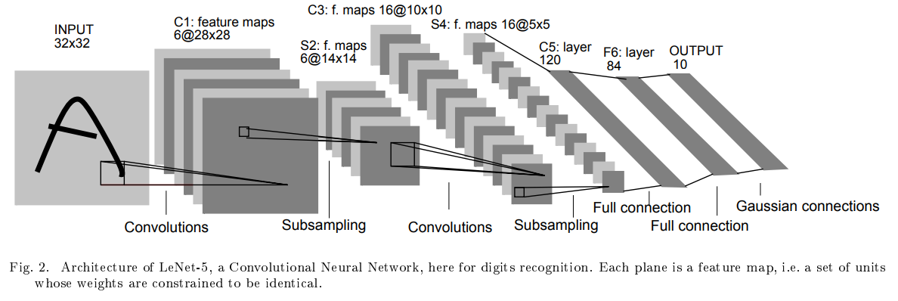

- One filter = one feature map
- Sliding the filter over the input
- Average pooling (subsampling) after each convolution: reduce the spatial dimensions (width and height) of feature maps
- Flattens the convolutional output into a vector
- Fully connected layers with 120, 84 and 10 outputs (10 digit classes)

## AlexNet (2012)
- Convolutional layers use filters of sizes 11 × 11, 5 × 5, 3 × 3
- Rectified Linear Units (ReLUs) $f(x)=\max(0,x)$
- Local Response Normalization (LRN)
- Dropout
- Data augmentation
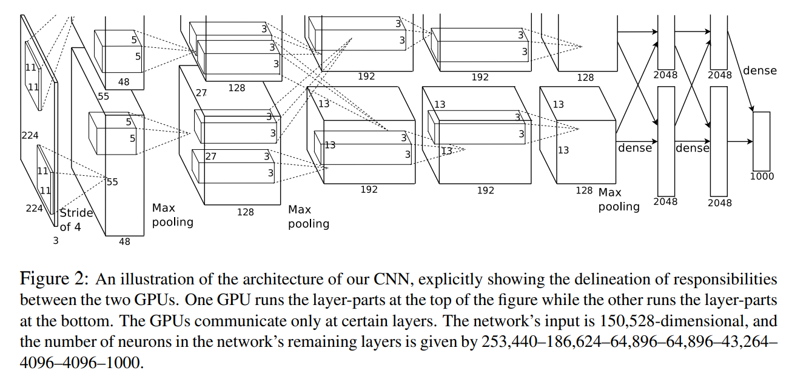

## VGGNet (2014)
- The image is passed through a stack of convolutional layers, with a very small receptive field: 3 × 3
- Stacks of two 3 × 3 convolutions achieve an effective receptive field of 5 × 5 (three reach 7 × 7)
- The convolution stride is fixed to 1 pixel
- Max-pooling is performed over a 2 × 2 pixel window, with stride 2
- Three Fully-Connected (FC) layers (4096, 4096, 1000)
- The final layer is the soft-max layer
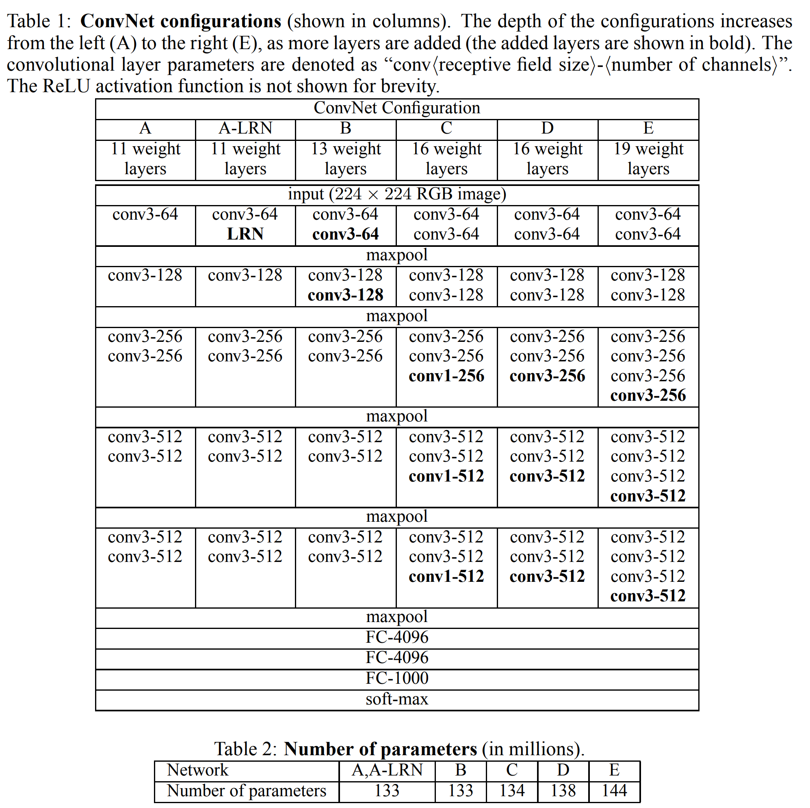

## Inception v1 (2014)
- GoogLeNet
- Filter sizes 1 × 1, 3 × 3 and 5 × 5
  >"...in our setting, 1 × 1 convolutions have dual purpose: most critically, they are used mainly as dimension reduction modules to remove computational bottlenecks, that would otherwise limit the size of our networks. This allows for not just increasing the depth, but also the width of our networks without significant performance penalty."
  
  >"...1 × 1 convolutions are used to compute reductions before the expensive 3 × 3 and 5 × 5 convolutions."
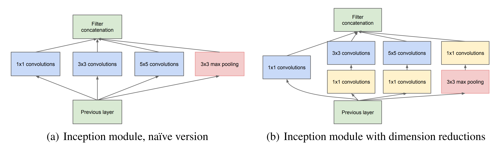
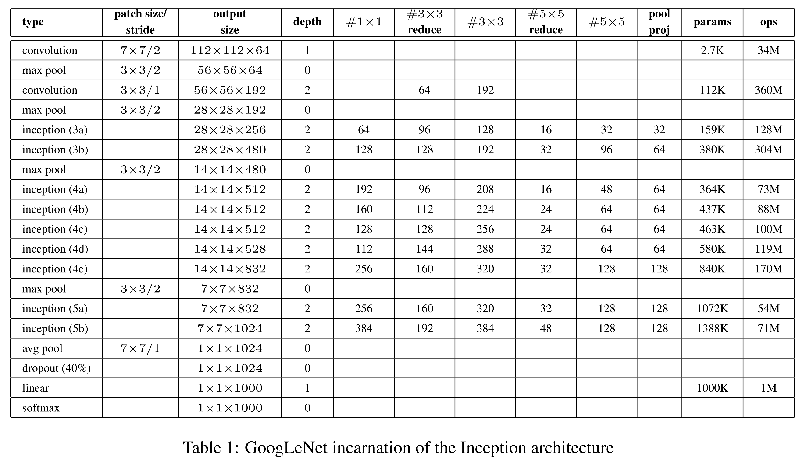

## Inception v2/v3 (2015)
- Factorizing larger convolutions into smaller ones
- Replaced 5 × 5 convolutional filters with two 3 × 3 filters applied in series
> "Table 3 shows the experimental results about the recognition performance of our proposed architecture (Inceptionv2) as described in Section 6.
Each Inception-v2 line shows the result of the cumulative changes... We are referring to the model in last row of Table 3 as Inception-v3"

  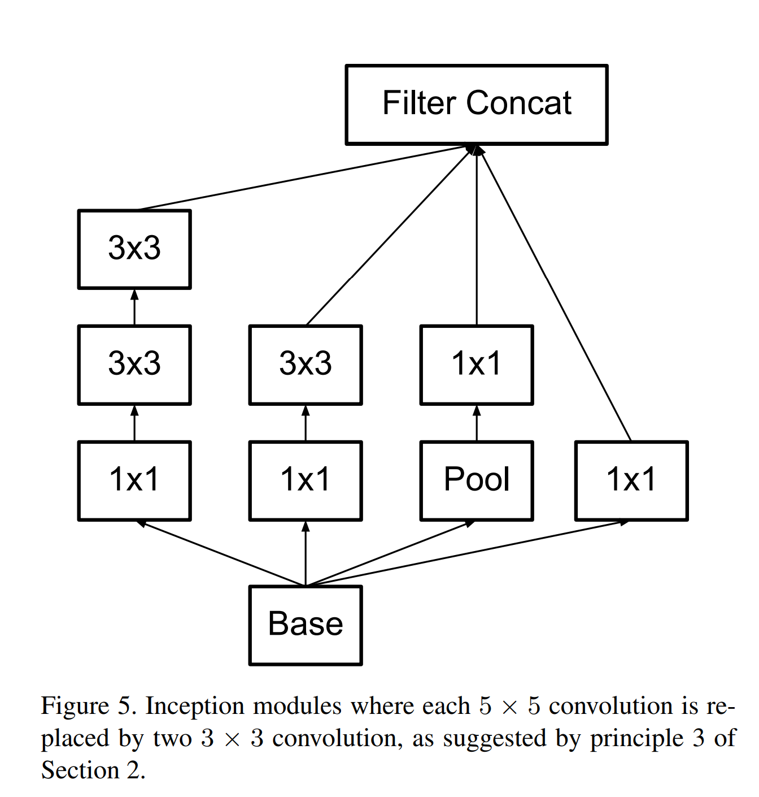

  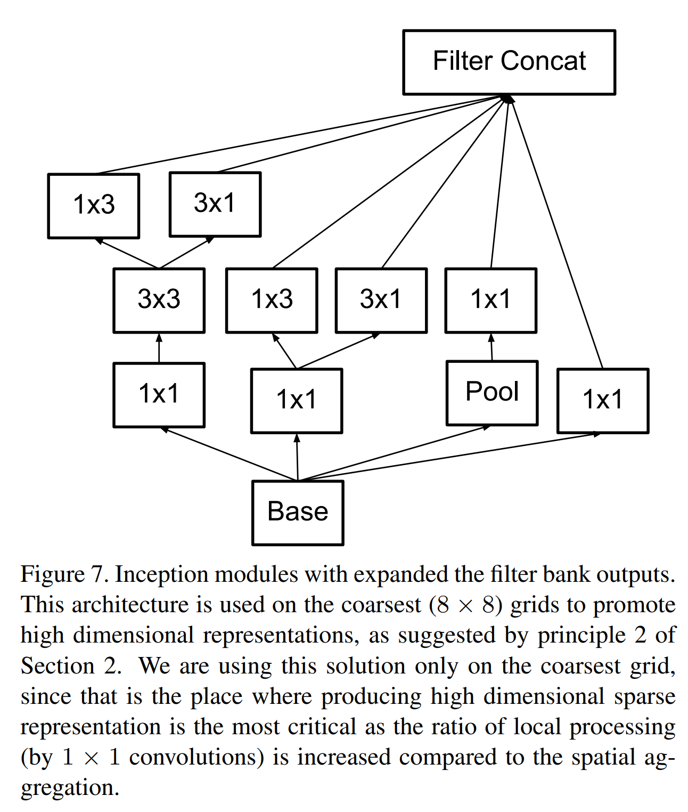

  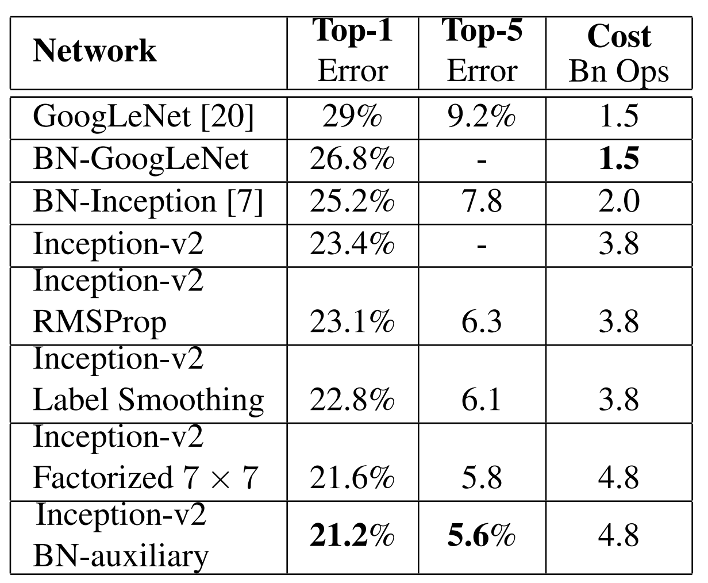

## PReLU-net (2015)
> "In this paper, we investigate neural networks from two aspects particularly driven by the rectifiers. First, we
propose a new generalization of ReLU, which we call Parametric Rectified Linear Unit (PReLU). This activation
function adaptively learns the parameters of the rectifiers, and improves accuracy at negligible extra computational cost."

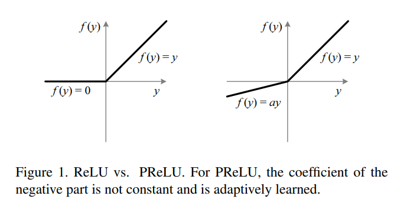

> "Second, we study the difficulty of training rectified models that are very deep. By explicitly modeling the nonlinearity of rectifiers (ReLU/PReLU), we derive a theoretically sound initialization method, which helps with convergence of very deep models (e.g., with 30 weight layers)
trained directly from scratch. This gives us more flexibility to explore more powerful network architectures."

> "Glorot and Bengio [7] proposed to adopt a properly scaled uniform distribution for initialization. This is called
“Xavier” initialization in [14]. Its derivation is based on the assumption that the activations are linear. This assumption
is invalid for ReLU and PReLU. In the following, we derive a theoretically more sound
initialization by taking ReLU/PReLU into account. In our experiments, our initialization method allows for extremely
deep models (e.g., 30 conv/fc layers) to converge, while the “Xavier” method [7] cannot."

  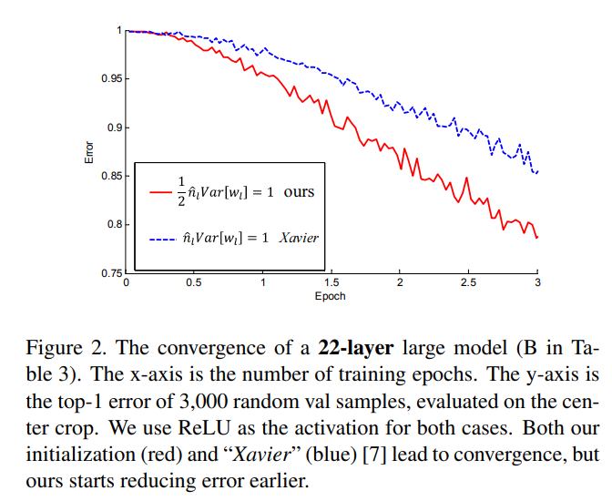

  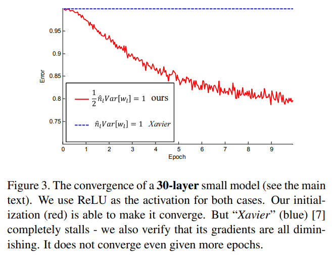

## ResNet (2015)
>"Deeper neural networks are more difficult to train. We present a residual learning framework to ease the training
of networks that are substantially deeper than those used previously."

>"In our case, the shortcut connections simply perform identity mapping, and their outputs are added to
the outputs of the stacked layers (Fig. 2)."
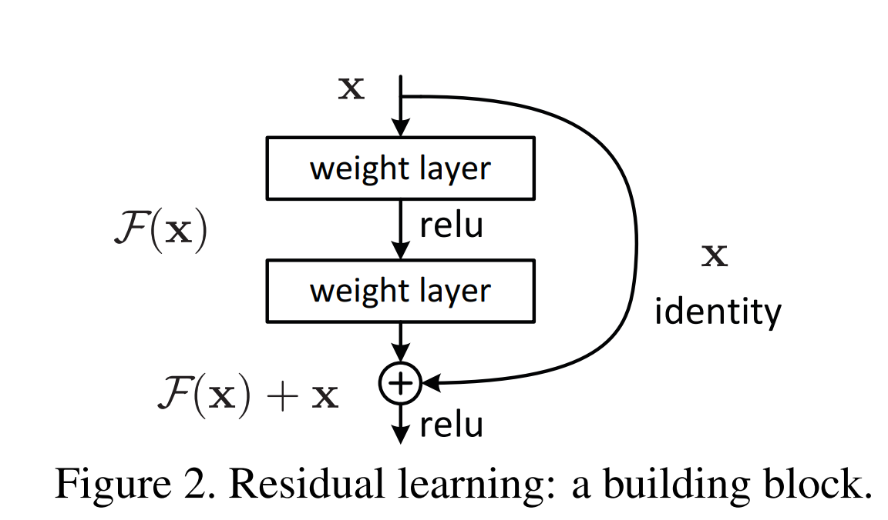

> "Deeper Bottleneck Architectures. For each residual function F, we use a stack of 3 layers instead of 2 (Fig. 5). The three layers
are 1 × 1, 3 × 3, and 1 × 1 convolutions, where the 1 × 1 layers are responsible for reducing and then increasing (restoring)
dimensions, leaving the 3×3 layer a bottleneck with smaller input/output dimensions. Fig. 5 shows an example, where
both designs have similar time complexity."
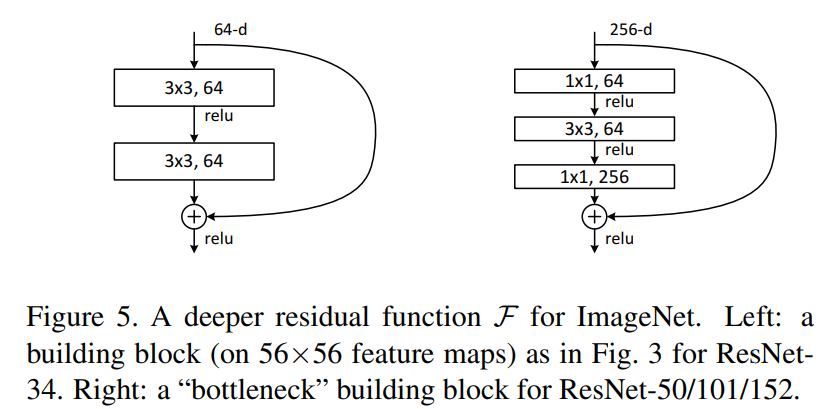

## ResNeXt (2016)
>"In this paper, we present a simple architecture which adopts VGG/ResNets’ strategy of repeating layers, while
exploiting the split-transform-merge strategy in an easy, extensible way. A module in our network performs a set
of transformations, each on a low-dimensional embedding, whose outputs are aggregated by summation. We pursuit a
simple realization of this idea — the transformations to be aggregated are all of the same topology (e.g., Fig. 1 (right)).
This design allows us to extend to any large number of transformations without specialized designs."

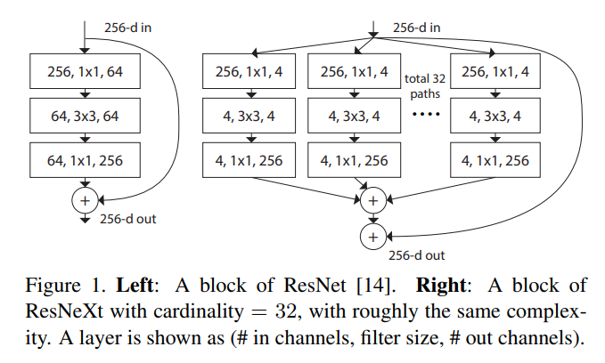

>"Our neural networks, named ResNeXt (suggesting the next dimension), outperform ResNet-101/152 [14], ResNet200 [15], Inception-v3 [39], and Inception-ResNet-v2 [37] on the ImageNet classification dataset. In particular, a 101-layer ResNeXt is able to achieve better accuracy than ResNet-200 [15] but has only 50% complexity."

>"Relation to Grouped Convolutions. The above module becomes more succinct using the notation of grouped convolutions [24]. This reformulation is illustrated in Fig. 3(c). All the low-dimensional embeddings (the first 1 × 1 layers) can be replaced by a single, wider layer (e.g., 1 × 1, 128-d in Fig 3(c)). Splitting is essentially done by the grouped convolutional layer when it divides its input channels into groups. The grouped convolutional layer in Fig. 3(c) performs 32 groups of convolutions whose input and output channels are 4-dimensional. The grouped convolutional layer concatenates them as the outputs of the layer. The block in Fig. 3(c) looks like the original bottleneck residual block in Fig. 1(left), except that Fig. 3(c) is a wider but sparsely connected module."

> "In a group conv layer [24], input and output channels are divided into C groups, and convolutions are separately performed within each group."

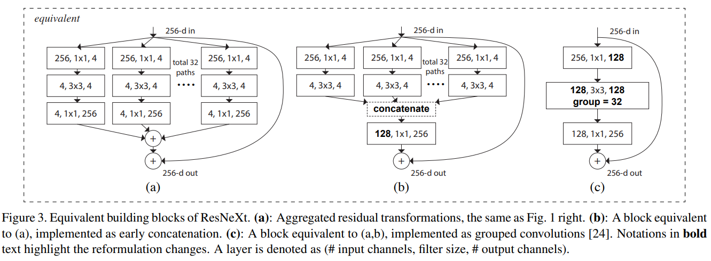

## DenseNet (2016)

>"Crucially, in contrast to ResNets, we never combine features through summation before they are passed into a layer; instead, we combine features by concatenating them."

> "Dense connectivity. To further improve the information flow between layers we propose a different connectivity pattern: we introduce direct connections from any layer to all subsequent layers. Figure 1 illustrates the layout of the resulting DenseNet schematically."

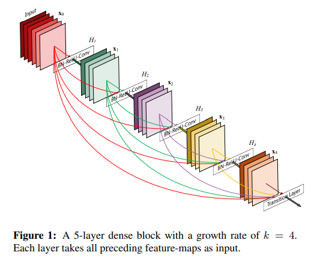

> "The growth rate regulates how much new information each layer contributes to the global state."

## MobileNet (2017)
> "The MobileNet model is based on depthwise separable convolutions which is a form of factorized convolutions
which factorize a standard convolution into a depthwise convolution and a 1×1 convolution called a pointwise convolution. "

> "For MobileNets the depthwise convolution applies a single filter to each input channel. The pointwise
convolution then applies a 1×1 convolution to combine the outputs the depthwise convolution. A standard convolution
both filters and combines inputs into a new set of outputs in one step. The depthwise separable convolution splits this
into two layers, a separate layer for filtering and a separate layer for combining. This factorization has the effect of
drastically reducing computation and model size."

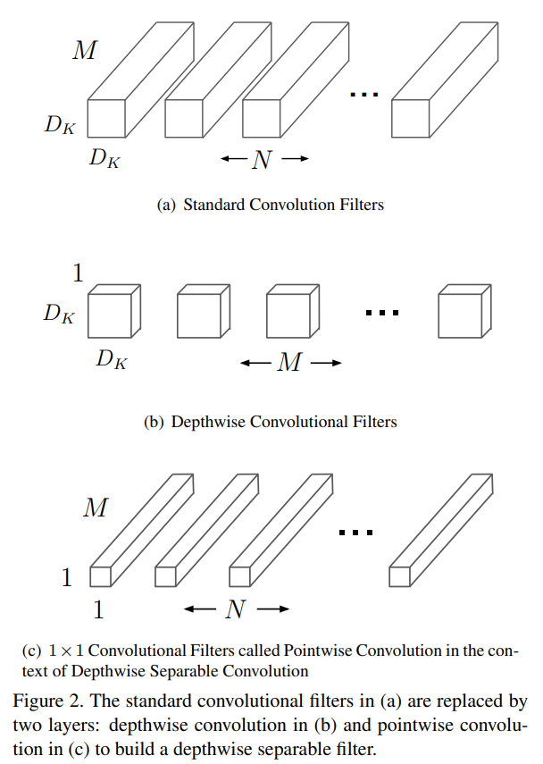

## ShuffleNet (2017)

> "We notice that state-of-the-art basic architectures such as Xception [3] and ResNeXt [40] become less efficient in extremely small networks because of the costly dense 1 × 1
convolutions. We propose using pointwise group convolutions to reduce computation complexity of 1 × 1 convolutions. To overcome the side effects brought by group convolutions, we come up with a novel channel shuffle operation to help the information flowing across feature channels. Based on the two techniques, we build a highly efficient architecture called ShuffleNet."

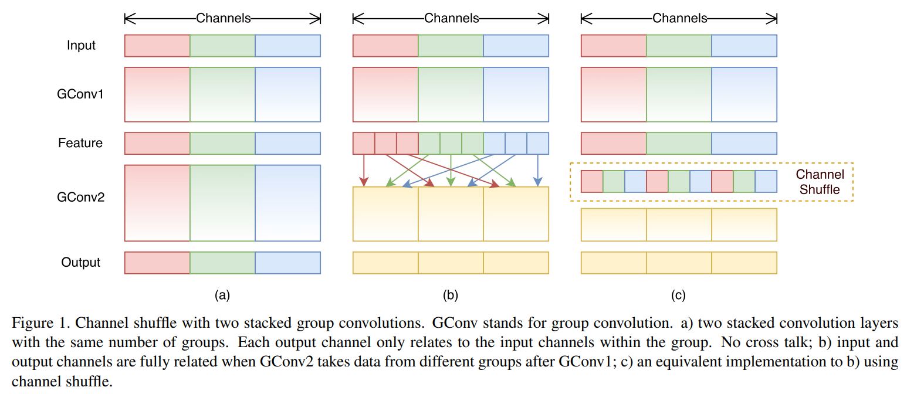

> "Taking advantage of the channel shuffle operation, we propose a novel ShuffleNet unit specially designed for small networks."

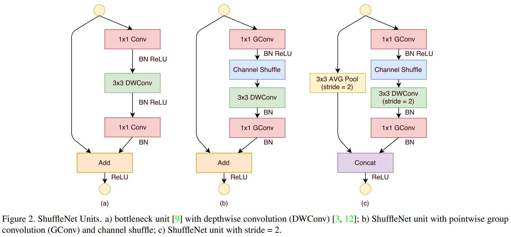

## MobileNetV2 (2018)
> "Our main contribution is a novel layer module: the inverted residual with linear bottleneck. This module takes as an input a low-dimensional compressed
representation which is first expanded to high dimension and filtered with a lightweight depthwise convolution. Features are subsequently projected back to a
low-dimensional representation with a linear convolution."

>"However, inspired by the intuition that the bottlenecks actually contain all the necessary information, while an
expansion layer acts merely as an implementation detail that accompanies a non-linear transformation of the tensor, we use shortcuts directly between the bottlenecks."

> "Figure 3 provides a schematic visualization of the difference in the designs. The motivation for inserting shortcuts is similar to that of classical residual connections:
we want to improve the ability of a gradient to propagate across multiplier layers. However, the inverted design is considerably more memory efficient (see Section 5 for details), as well as works slightly better in our experiments."

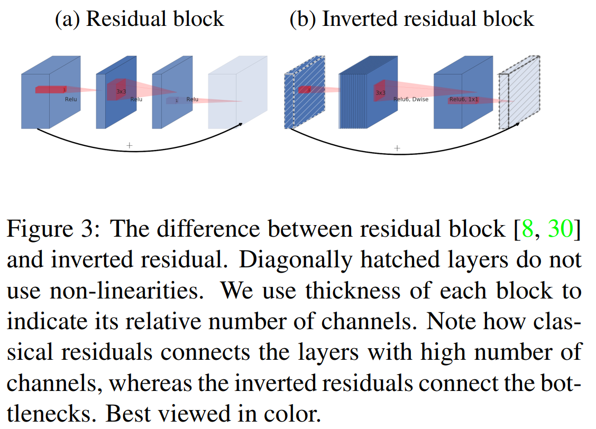
