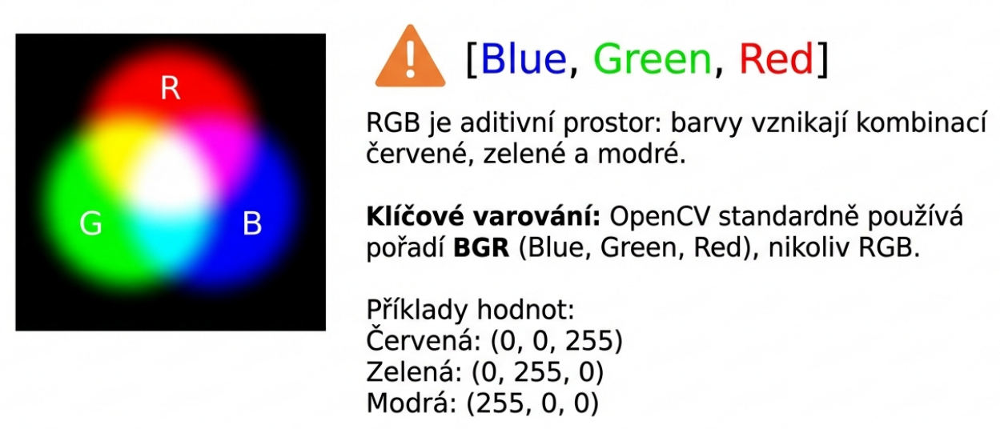
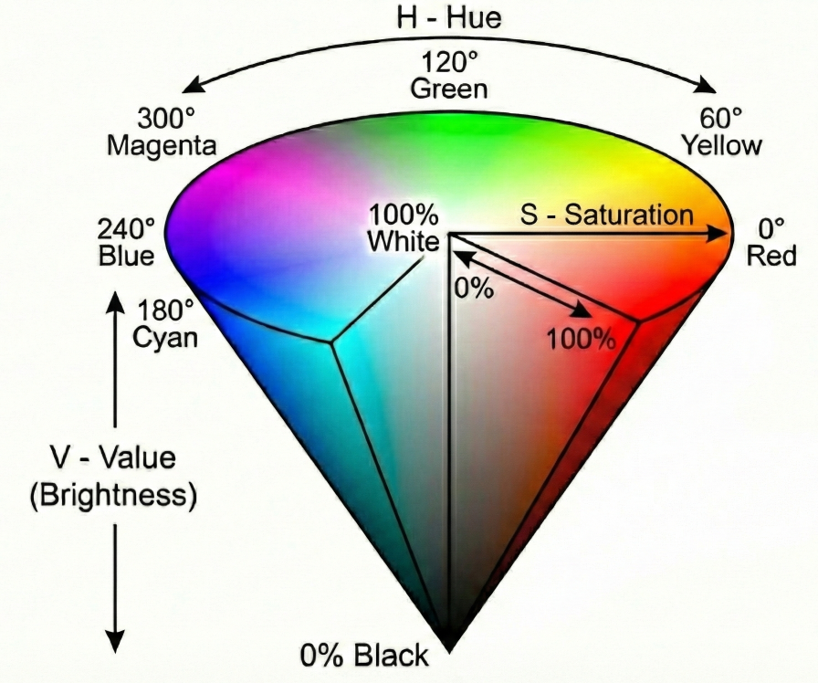
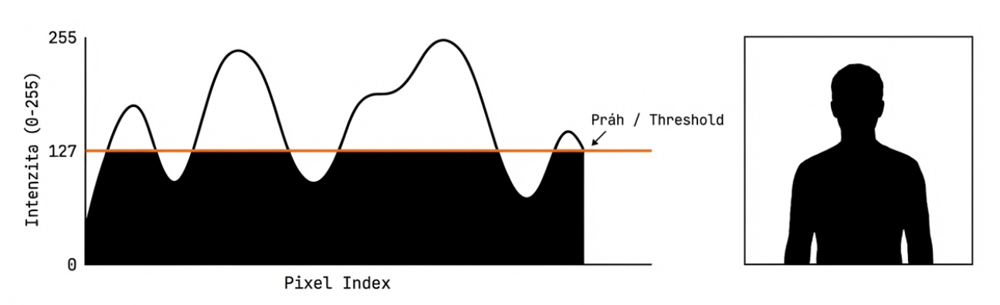
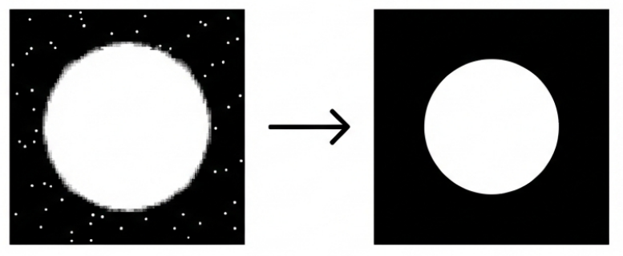
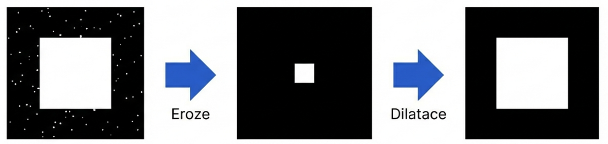
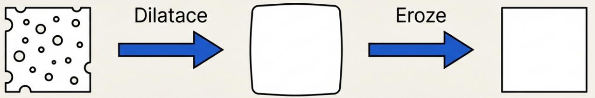
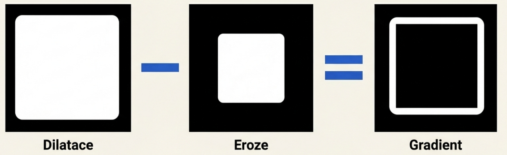
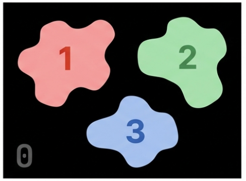

## Barevné prostory (Color Spaces)

### RGB (Red, Green, Blue)

RGB je aditivní barevný prostor, kde se barvy vytvářejí kombinací intenzit červeného, zeleného a modrého světla. OpenCV používá BGR (Blue, Green, Red) místo RGB jako výchozí pořadí kanálů.

**Základní RGB hodnoty:**
- `(255,0,0)` - Čistá červená
- `(0,255,0)` - Čistá zelená  
- `(0,0,255)` - Čistá modrá
- `(255,255,0)` - Žlutá (červená + zelená)



```python
import cv2
import numpy as np
import matplotlib.pyplot as plt

# Načtení obrázku
image = cv2.imread("red-tlight.png")

# Změna velikosti obrázku
image = cv2.resize(image, (100, 200))

# Získání rozměrů obrázku
h, w, c = image.shape

# Rozdělení BGR kanálů
b, g, r = cv2.split(image)

# Konverze BGR na RGB
image_rgb = cv2.cvtColor(image, cv2.COLOR_BGR2RGB)
```

### HSV (Hue, Saturation, Value)

HSV odděluje informaci o barvě (hue) od intenzity (value) a saturace. Je to vhodný model například pro segmentaci objektů na základě barvy.

- **Hue** - Typ barvy (odstín)
- **Saturation** - Čistota barvy
- **Value** - Jas/intenzita barvy



```python
# Konverze BGR na HSV
hsv_image = cv2.cvtColor(image, cv2.COLOR_BGR2HSV)

# Jak najít HSV hodnoty pro sledování konkrétní barvy
green = np.uint8([[[0, 255, 0]]])
hsv_green = cv2.cvtColor(green, cv2.COLOR_BGR2HSV)
print(hsv_green)  # Output: [[[60 255 255]]]

# Definice rozsahu pro detekci barvy
lower_bound = np.array([50, 100, 100])  # [H-10, 100, 100]
upper_bound = np.array([70, 255, 255])  # [H+10, 255, 255]

# Vytvoření masky pro izolaci barvy
mask = cv2.inRange(hsv_image, lower_bound, upper_bound)
```

**Poznámka:** V OpenCV je rozsah pro Hue [0,179], Saturation [0,255] a Value [0,255].

### Grayscale (Stupně šedi)

Jednokanálová reprezentace obrázku, kde každý pixel představuje intenzitu (jas) na škále od černé (0) do bílé (255).

```python
# Konverze BGR na stupně šedi
gray_image = cv2.cvtColor(image, cv2.COLOR_BGR2GRAY)
```

## Prahování (Thresholding)

Prahování je nejjednodušší metoda segmentace. Slouží k oddělení oblastí obrázku odpovídajících objektů, které chceme analyzovat.

### Binární prahování (Binary Threshold)



```python
# Binární prahování
# Pokud je pixel světlejší než práh (127), obarví se na bílo (255). Všechno tmavší bude černé (0).
ret, thresh_binary = cv2.threshold(gray_image, 127, 255, cv2.THRESH_BINARY)

# Invertované binární prahování (obrácené)
# Pokud je pixel světlejší než práh (127), obarví se na černo (0). Všechno tmavší bude bílé (255).
ret, thresh_binary_inv = cv2.threshold(gray_image, 127, 255, cv2.THRESH_BINARY_INV)
```

## Morfologické operace

Morfologické operace jsou jednoduché operace, které se velmi často používají na binární obrazy. Slouží k odstranění šumu, izolaci jednotlivých prvků a spojení oddělených prvků v obraze.

### Strukturní elementy (Kernels)

```python
# Obdélníkový kernel
kernel_rect = np.ones((5, 5), np.uint8)
# nebo
kernel_rect = cv2.getStructuringElement(cv2.MORPH_RECT, (5, 5))

# Křížový kernel
kernel_cross = cv2.getStructuringElement(cv2.MORPH_CROSS, (5, 5))

# Eliptický kernel
kernel_ellipse = cv2.getStructuringElement(cv2.MORPH_ELLIPSE, (15, 15))
```

### Eroze (Erosion)

Eroze zmenšuje objekty v obraze. Pixel v původním obraze bude považován za 1 pouze pokud jsou všechny pixely pod kernelem 1, jinak je erodován (nastaven na nulu).

**Aplikace:**
- Odstranění malého šumu
- Oddělení objektů
- Zjednodušení hranic



```python
# Načtení obrázku
img_input = cv2.imread('img.png', 0)

# Vytvoření strukturního elementu
kernel = cv2.getStructuringElement(cv2.MORPH_RECT, (11, 11))

# Prahování
ret, img_th = cv2.threshold(img_input, 50, 255, cv2.THRESH_BINARY_INV)

# Eroze
img_erode = cv2.erode(img_th, kernel, iterations=1)

# Eroze na barevném/šedotónovém obrázku (min operace)
img_gray = cv2.imread('image.jpg', cv2.IMREAD_GRAYSCALE)
img_eroded_gray = cv2.erode(img_gray, kernel, iterations=1)
```

### Dilatace (Dilation)

Dilatace je opakem eroze - pixel je '1' pokud je alespoň jeden pixel pod kernelem '1'. Rozšiřuje objekty přidáním pixelů k jejich hranicím.

**Aplikace:**
- Vyplnění malých mezer a děr
- Spojení blízkých objektů
- Rozšíření hranic objektů


```python
# Dilatace
img_dilate = cv2.dilate(img_th, kernel, iterations=1)
```

### Opening (Otevření)

Opening = eroze následovaná dilatací. Odstraňuje malý šum zachováním větších objektů.



```python
# Opening - odstranění šumu
img_opening = cv2.morphologyEx(img_th, cv2.MORPH_OPEN, kernel)

# Nebo manuálně
img_opening_manual = cv2.dilate(cv2.erode(img_th, kernel), kernel)
```

### Closing (Uzavření)

Closing = dilatace následovaná erozí. Vyplňuje malé mezery v objektech.



```python
# Closing - vyplnění mezer
img_closing = cv2.morphologyEx(img_th, cv2.MORPH_CLOSE, kernel)

# Nebo manuálně
img_closing_manual = cv2.erode(cv2.dilate(img_th, kernel), kernel)
```

### Morfologický gradient

Rozdíl mezi dilatací a erozí obrazu. Zvýrazňuje hrany objektů.




```python
# Morfologický gradient - detekce hran
img_gradient = cv2.morphologyEx(img_th, cv2.MORPH_GRADIENT, kernel)

# Nebo manuálně
img_gradient_manual = cv2.dilate(img_th, kernel) - cv2.erode(img_th, kernel)
```

## scikit-image (alternativa k OpenCV) 

```python
from skimage import io, color, filters
from skimage.morphology import disk, erosion, dilation, opening, closing
import numpy as np

# Načtení obrázku pomocí scikit-image
img = io.imread('input_image.jpg')

# Konverze na grayscale
gray = color.rgb2gray(img)

# Prahování
threshold_value = filters.threshold_otsu(gray)
binary = gray > threshold_value

# Vytvoření strukturního elementu
selem = disk(5)

# Morfologické operace
img_eroded = erosion(binary, selem)
img_dilated = dilation(binary, selem)
img_opened = opening(binary, selem)
img_closed = closing(binary, selem)

# Zobrazení
import matplotlib.pyplot as plt
fig, axes = plt.subplots(2, 3, figsize=(15, 10))
axes[0, 0].imshow(gray, cmap='gray')
axes[0, 0].set_title('Grayscale')
axes[0, 1].imshow(binary, cmap='gray')
axes[0, 1].set_title('Binary')
axes[0, 2].imshow(img_eroded, cmap='gray')
axes[0, 2].set_title('Erosion')
axes[1, 0].imshow(img_dilated, cmap='gray')
axes[1, 0].set_title('Dilation')
axes[1, 1].imshow(img_opened, cmap='gray')
axes[1, 1].set_title('Opening')
axes[1, 2].imshow(img_closed, cmap='gray')
axes[1, 2].set_title('Closing')
plt.tight_layout()
plt.show()
```

## Connected Components (Labelování souvislých oblastí)

K označení (labelování) souvislých oblastí v binárním obraze je možné využít například funkci `cv2.connectedComponents()`. Každé skupině propojených bílých pixelů je přiřazen unikátní celočíselný identifikátor (label). Pozadí má label `0`.



### Typický pipeline

```
Vstupní obraz → Prahování → Morfologie (opening/closing) → connectedComponents → Analýza
```

Morfologické operace se aplikují před `connectedComponents()`, aby se odstranily šumové pixely (které by jinak tvořily samostatné oblasti) a aby se spojily fragmentované objekty.


### Základní použití

```python
import cv2
import numpy as np

# Binární obraz (po prahování)
ret, binary = cv2.threshold(gray, 127, 255, cv2.THRESH_BINARY)

# Labelování
num_labels, labels = cv2.connectedComponents(binary)
# num_labels = počet oblastí + 1 (pozadí)
# labels    = matice stejné velikosti jako vstup, každý pixel má číslo své oblasti
```

### Varianta se statistikami

```python
num_labels, labels, stats, centroids = cv2.connectedComponentsWithStats(binary)

# stats[i] obsahuje pro každou oblast i:
#   stats[i, cv2.CC_STAT_LEFT]   - x souřadnice bounding boxu
#   stats[i, cv2.CC_STAT_TOP]    - y souřadnice bounding boxu
#   stats[i, cv2.CC_STAT_WIDTH]  - šířka bounding boxu
#   stats[i, cv2.CC_STAT_HEIGHT] - výška bounding boxu
#   stats[i, cv2.CC_STAT_AREA]   - plocha v pixelech

# centroids[i] obsahuje (x, y) těžiště oblasti i
```

## Kam dál: Moderní přístupy k segmentaci

Klasické metody analýzy obrazu (kombinace: barevné prostory, prahování, morfologické operace) mají v počítačovém vidění stále své místo - jsou rychlé, výpočetně nenáročné a fungují ihned bez nutnosti složitě sbírat a anotovat data. 

Pokud ale klasické metody nestačí, přichází na řadu modely hlubokého učení (Deep Learning). Mezi ty nejzajímavější v oblasti segmentace dnes patří:

* **U-Net:** Architektura (a její další varianty, např. UNet++) původně navržená pro medicínské snímky, dnes jde o standard pro přesnou sémantickou segmentaci na úrovni pixelů.

*[Více o U-Net](https://arxiv.org/abs/1505.04597)*

* **Segment Anything Model (SAM 1, 2, 3):** Výkonný model od společnosti Meta. Dokáže automaticky vyříznout (segmentovat) jakýkoliv objekt na obrázku bez předchozího specifického trénování (tzv. zero-shot přístup).

*[Oficiální web Segment Anything](https://segment-anything.com/)*

* **Ultralytics:** Populární knihovna známá především pro detektory YOLO. Dnes už ale přímo integruje i modely jako SAM, což umožňuje jejich extrémně snadné nasazení pomocí kódu v Pythonu.
*[Dokumentace Ultralytics pro model SAM](https://docs.ultralytics.com/models/sam/)*

## Reference

- [OpenCV Color Spaces Tutorial](https://docs.opencv.org/4.11.0/df/d9d/tutorial_py_colorspaces.html)
- [OpenCV Thresholding Tutorial](https://docs.opencv.org/4.11.0/db/d8e/tutorial_threshold.html)
- [OpenCV Morphological Operations](https://docs.opencv.org/4.11.0/d9/d61/tutorial_py_morphological_ops.html)
- [OpenCV Erosion and Dilation](https://docs.opencv.org/4.11.0/db/df6/tutorial_erosion_dilatation.html)
- [Scikit-image Morphological Operations](https://scikit-image.org/docs/stable/api/skimage.morphology.html)

---
