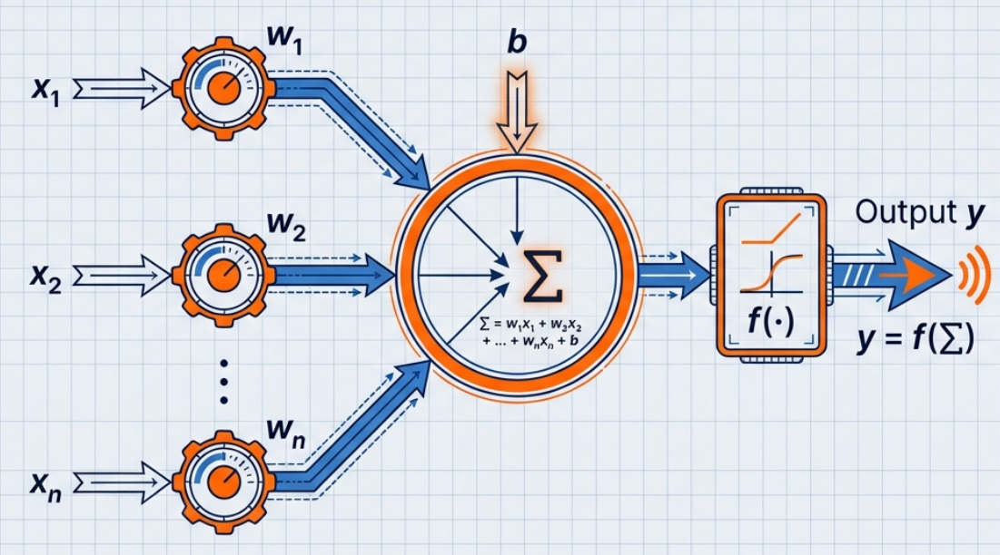
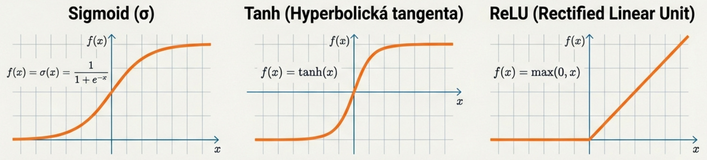
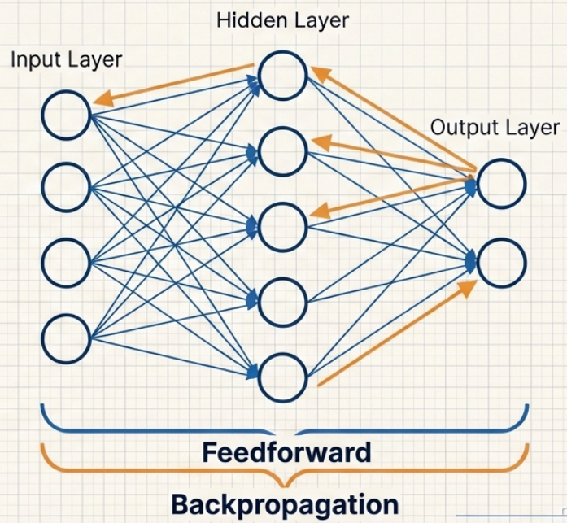
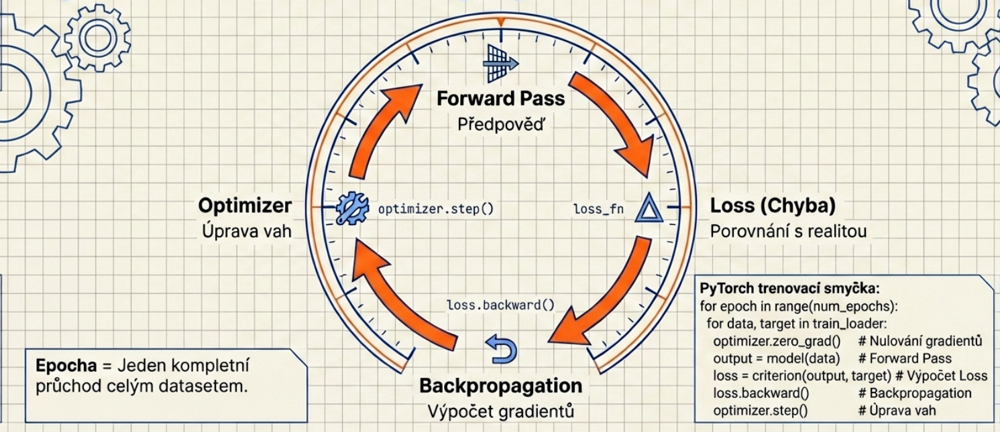
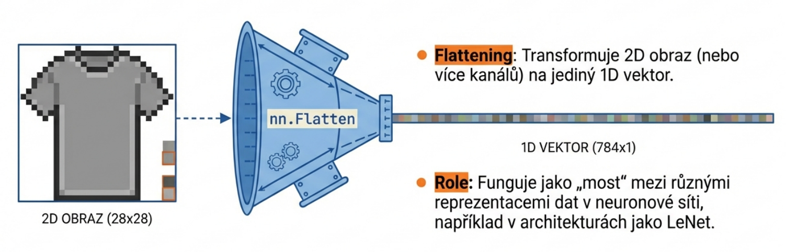
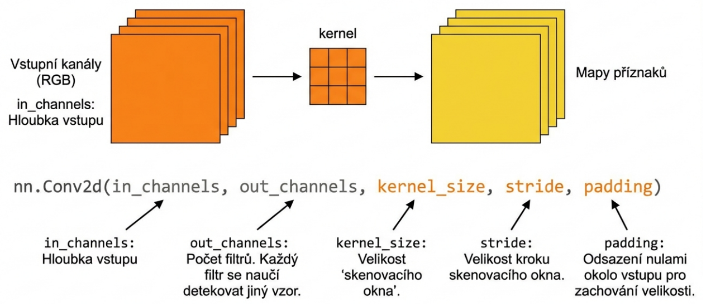
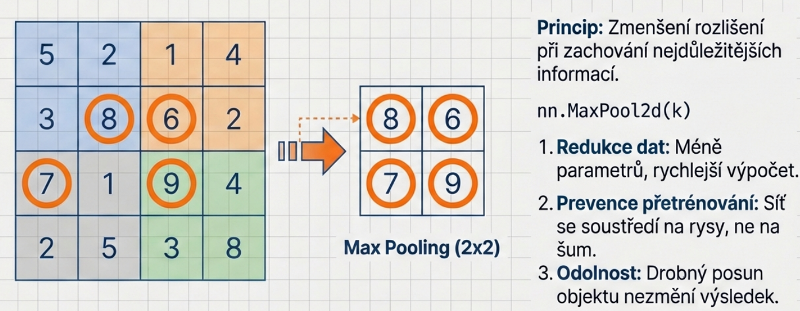
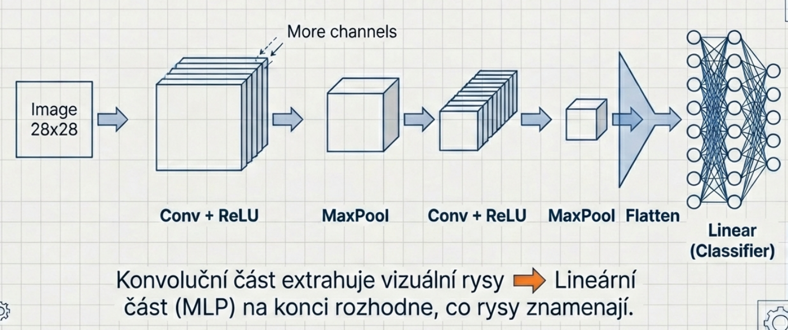

# Neuronové sítě v PyTorch

Materiál stručně pojednává o stavebních blocích neuronových a základních variant konvolučních neuronových sítí. 
*(Jedná se o pracovní verzi, proto prosím omluvte fakt, že se místy mohou objevit případné překlepy.)*

## 1. Co je neuronová síť?

Neuronová síť je matematický model inspirovaný fungováním mozku. Skládá se z **neuronů** (uzlů) propojených hranami s váhami.

### Jeden neuron



Základní funkce neuronu:

1. Vezme vstupy `x₁, x₂, ..., xₙ`
2. Každý vynásobí příslušnou váhou `w₁, w₂, ..., wₙ` (váhy určují sklon/rotaci rozhodovací roviny)
3. Sečte (+ přidá bias `b`, který posouvá rozhodovací rovinu, aniž by měnil její sklon)
4. Výsledek pošle přes **aktivační funkci**

```text 
výstup = f(w₁·x₁ + w₂·x₂ + ... + wₙ·xₙ + b)
```

### Proč aktivační funkce?



Bez aktivační funkce by celá síť — bez ohledu na počet vrstev — počítala jen
**lineární rovnici** (přímka, rovina). Lineární funkce nedokáže modelovat složité vzory.

Nejpoužívanější je **ReLU**: `f(x) = max(0, x)`

- Kladné hodnoty **projdou beze změny** — neuron "svítí"
- Záporné hodnoty se **oříznou na nulu** — neuron "mlčí"

Záporné hodnoty jsou "nulovány": reprezentují "neuron, který na daný vstup nereaguje". ReLU je oblíbená proto, že je výpočetně velmi jednoduchá a trénování s ní v mnoha případech funguje (existují i další verze, např. GELU, LeakyReLU).

---

## 2. Vrstvy a dopředná síť (MLP)



Neurony jsou organizovány do **vrstev**:

```text
Vstupní vrstva → Skrytá vrstva(y) → Výstupní vrstva
```

Každá vrstva dostane výstup předchozí a celý výpočet jde jen jedním směrem (dopředu) — proto se říká **dopředná síť** (feedforward / MLP — Multi-Layer Perceptron).

V PyTorch jednu plně propojenou vrstvu vyjadřuje `nn.Linear(in_features, out_features)`.

---

## 3. Jak se síť učí?



Učení probíhá opakováním těchto kroků:

1. **Dopředný průchod** — data projdou sítí, dostaneme předpověď
2. **Výpočet chyby (loss)** — porovnáme předpověď se správnou odpovědí
3. **Zpětné šíření (backpropagation)** — spočítáme, jak moc každá váha přispěla k chybě
4. **Aktualizace vah (optimizer)** — váhy posuneme tak, aby chyba příště byla menší

Toto se opakuje přes celý dataset mnohokrát — každý průchod celým datasetem se nazývá **epocha**.

---

## 4. Praktický příklad: rozpoznávání oblečení (FashionMNIST)

V ukázce je použit dataset FashionMNIST (28×28, oblečení v 10 kategoriích).


### Instalace

```bash
pip install torch torchvision
```

### Kompletní kód

```python
import torch
import torch.nn as nn
import torch.nn.functional as F
import torch.optim as optim
from torchvision import datasets, transforms
from torch.utils.data import DataLoader

# Nastavení výpočetního zařízení (GPU pokud je k dispozici, jinak CPU)
device = torch.device("cuda" if torch.cuda.is_available() else "cpu")
print(f"Používám zařízení: {device}")

# --- 1. Načtení dat ---
transform = transforms.Compose([
    transforms.ToTensor(),                   
    transforms.Normalize((0.5,), (0.5,))     # normalizace na -1.0–1.0
])

# dataset FashionMNIST je součástí torchvision
train_data = datasets.FashionMNIST(root='./data', train=True,  download=True, transform=transform)
test_data  = datasets.FashionMNIST(root='./data', train=False, download=True, transform=transform)

# POZNÁMKA: Pokud je potřeba načítat vlastní obrázky z adresáře,
# kde jsou rozdělené do složek podle tříd (např. data/cats, data/dogs),
# je možné použít datasets.ImageFolder:
# 
# my_train_data = datasets.ImageFolder(root='cesta/k/datum', transform=transform)
# train_loader  = DataLoader(my_train_data, batch_size=64, shuffle=True)
#
# Pro složitější případy (např. labely v CSV) se definuje vlastní třída dědící z Dataset.

# DataLoader rozdělí data do dávek — každá dávka (batch) má 64 obrázků
train_loader = DataLoader(train_data, batch_size=64, shuffle=True)
test_loader  = DataLoader(test_data,  batch_size=64, shuffle=False)

# --- 2. Definice sítě ---
class Net(nn.Module):
    def __init__(self):
        super().__init__()
        self.flatten = nn.Flatten()       # rozbalí obrázek 28×28 na vektor 784 čísel
        self.fc1 = nn.Linear(784, 128)    # vstup: 784 pixelů → 128 neuronů
        self.fc2 = nn.Linear(128, 10)     # výstup: 10 tříd (kategorie oblečení)

    def forward(self, x):
        x = self.flatten(x)               # (batch, 1, 28, 28) → (batch, 784)
        x = F.relu(self.fc1(x))
        x = self.fc2(x)                   # poslední vrstva bez aktivace — CrossEntropyLoss ji obsahuje
        return x

model = Net().to(device)

# --- 3. Loss funkce a optimizer ---
loss_fn   = nn.CrossEntropyLoss()
optimizer = optim.Adam(model.parameters(), lr=0.001)

# Příklad záměrně ukazuje pouze trénování a testování.
# V reálném nasazení je vhodné přidat i validační fázi (na datech,
# která síť během trénování nevidí) pro sledování přetrénování.

# --- 4. Trénování po dávkách ---
EPOCHS = 5
for epoch in range(1, EPOCHS + 1):
    model.train()
    total_loss = 0
    for images, labels in train_loader:      # dávka 64 obrázků
        images, labels = images.to(device), labels.to(device)
        predictions = model(images)          # dopředný průchod
        loss = loss_fn(predictions, labels)  # výpočet chyby
        # aktualizace vah:
        optimizer.zero_grad()                # 1) vynuluj staré gradienty
        loss.backward()                      # 2) spočítej nové gradienty (zpětné šíření)
        optimizer.step()                     # 3) posuň váhy ve směru menší chyby
        total_loss += loss.item()
    avg_loss = total_loss / len(train_loader)
    print(f"Epoch {epoch}/{EPOCHS}  |  Loss: {avg_loss:.4f}")

# Uložení natrénovaných vah
torch.save(model.state_dict(), "model.pth")
print("Váhy uloženy do model.pth")

# Načtení vah (např. pro pozdější použití bez trénování)
model.load_state_dict(torch.load("model.pth"))
model.eval()

# --- 5. Testování (jednorázově po dokončení trénování) ---
model.eval()
correct = 0
total   = 0
with torch.no_grad():
    for images, labels in test_loader:
        images, labels = images.to(device), labels.to(device)
        predictions = model(images)
        _, predicted = torch.max(predictions, dim=1)  # hledá maximum přes dimenzi tříd
        correct += (predicted == labels).sum().item()
        total   += labels.size(0)

accuracy = correct / total
print(f"Přesnost na testovacích datech: {accuracy*100:.2f}%")

```
Vizualizace  `nn.Flatten()`




### Ukázkový výstup

```text
Epoch 1/5  |  Loss: 0.4974
Epoch 2/5  |  Loss: 0.3811
Epoch 3/5  |  Loss: 0.3419
Epoch 4/5  |  Loss: 0.3181
Epoch 5/5  |  Loss: 0.2992
Váhy uloženy do model.pth
Přesnost na testovacích datech: 86.06%
```


---

## 5. Shrnutí

| Pojem | Vysvětlení |
|---|---|
| `nn.Flatten()` | Převede 2D obrázek na 1D vektor |
| `nn.Linear(a, b)` | Plně propojená vrstva: `a` vstupů (hodnoty z předchozí vrstvy), `b` výstupních neuronů |
| `nn.ReLU()` | Aktivační funkce (záporné hodnoty → 0) |
| `nn.Sequential` | Vrství vrstvy za sebou |
| `loss_fn` | Měří, jak moc se síť plete |
| `optimizer` | Aktualizuje váhy tak, aby chyba/loss klesala |
| `loss.backward()` | Zpětné šíření — spočítá gradienty |
| `optimizer.step()` | Jedna aktualizace vah |

---


# Konvoluční sítě (CNN) v PyTorch

V předchozím tutoriálu jsme obrázek 28×28 "rozbalili" na vektor 784 čísel a poslali ho do `nn.Linear`. Fungovalo to, ale má to určité nevýhody:

- **Ztratíme prostorové vztahy** — sousední pixely nejsou pro síť nijak speciální
- **Špatně škáluje** — obrázek 224×224 RGB = 150 528 vstupů, to je obrovský počet parametrů
- **Síť se nestará o polohu** — stejný objekt na jiném místě v obrázku vypadá pro MLP úplně jinak

Konvoluční síť (CNN) tyto problémy řeší (do určité míry).

---

## 1. Klíčový nápad: konvoluce

Místo toho, aby každý neuron viděl celý obrázek, CNN používá malý **filtr** (kernel), který obrázkem "přejíždí".


Filtr (kernel) je malá matice vah (například o rozměru $3 \times 3$). Tento filtr se posouvá po vstupních datech a v každém kroku provádí skalární součin (element-wise multiplication) mezi svými váhami a hodnotami pixelů v aktuálním výřezu. Výsledné hodnoty se sečtou a vytvoří jeden bod v nové matici, které říkáme feature map (mapa příznaků). Každý filtr se **naučí** detekovat jeden vzor (např. hrana, roh, kruhovitý tvar).

Klíčem je, že hodnoty uvnitř filtru nejsou pevně nastaveny programátorem. Jsou to parametry (váhy), které se neuronová síť sama naučí během trénování pomocí algoritmu backpropagation. Síť tak sama zjistí, jaké číselné kombinace v matici nejlépe detekují hrany nebo textury.

Vrstva `nn.Conv2d` má typicky desítky nebo stovky takových filtrů — každý hledá něco jiného.

Při definici konvoluční vrstvy `nn.Conv2d` v kódu určujeme tyto technické aspekty:
- In/Out Channels: Vstupní kanály (např. 3 pro RGB) a počet filtrů na výstupu (kolik různých vzorů hledáme).
- Kernel Size: Velikost „okna“ filtru (např. $3 \times 3$).
- Stride: Velikost kroku (v pixelech), o který se filtr při každém výpočtu posune.
- Padding: Doplnění okrajů obrázku (obvykle nulami), aby výstupní mapa nebyla menší než vstup.





---

## 2. Pooling — zmenšení rozměrů



Po konvoluci se obvykle zařazuje **Pooling** (např. max): rozdělí feature mapu na malá okna a z každého vezme maximum.


Pooling 2×2 v tomto případě zmenší rozměry na polovinu. Má tři výhody:

- **Redukce dimenzionality** — méně dat → méně parametrů v dalších vrstvách → rychlejší výpočet
- **Odolnost vůči posunům** (translation invariance) — drobná změna polohy objektu nezmění výstup
- **Prevence přetrénování** — síť je nucena zachytit jen nejdůležitější rysy, ne konkrétní pixely

---

## 3. Celková architektura CNN



```text
Vstup (obrázek)
      ↓
  Conv2d + ReLU    ← detekce jednoduchých vzorů (hrany)
      ↓
  MaxPool2d        ← zmenšení rozměrů
      ↓
  Conv2d + ReLU    ← detekce složitějších vzorů (tvary)
      ↓
  MaxPool2d
      ↓
  Flatten          ← převod na 1D vektor
      ↓
  Linear + ReLU    ← klasifikace (stejně jako v MLP!)
      ↓
  Linear           ← výstup (počet tříd)
```

> **CNN tedy navazuje na MLP**: konvoluční vrstvy extrahují příznaky z obrázku a plně propojené vrstvy (`nn.Linear`) na konci provedou samotnou klasifikaci.

---

## 4. Praktický příklad: CNN na FashionMNIST

V ukázce je použit dataset FashionMNIST (28×28, oblečení v 10 kategoriích).

```python
import torch
import torch.nn as nn
import torch.optim as optim
from torchvision import datasets, transforms
from torch.utils.data import DataLoader

# Nastavení výpočetního zařízení (GPU pokud je k dispozici, jinak CPU)
device = torch.device("cuda" if torch.cuda.is_available() else "cpu")
print(f"Používám zařízení: {device}")

# --- 1. Načtení dat ---
transform = transforms.Compose([
    transforms.ToTensor(),
    transforms.Normalize((0.5,), (0.5,))
])

train_data = datasets.FashionMNIST(root='./data', train=True,  download=True, transform=transform)
test_data  = datasets.FashionMNIST(root='./data', train=False, download=True, transform=transform)

train_loader = DataLoader(train_data, batch_size=64, shuffle=True)
test_loader  = DataLoader(test_data,  batch_size=64, shuffle=False)

# --- 2. Definice CNN ---
class CNN(nn.Module):
    def __init__(self):
        super().__init__()

        # Konvoluční část — extrakce rysů z obrázku
        self.features = nn.Sequential(
            # Vstup: 1 kanál (šedotón), 32 filtrů 3×3
            # padding=1 zachová rozměr po aplikaci konvolučních filtrů o velikosti 3×3: 28×28 → 28×28
            nn.Conv2d(in_channels=1, out_channels=32, kernel_size=3, padding=1),
            nn.ReLU(),
            # MaxPool 2×2 → rozměr 14×14
            nn.MaxPool2d(kernel_size=2),

            # 32 vstupních kanálů, 64 filtrů 3×3
            # padding=1 zachová rozměr: 14×14 → 14×14
            nn.Conv2d(in_channels=32, out_channels=64, kernel_size=3, padding=1),
            nn.ReLU(),
            # MaxPool 2×2 → rozměr 7×7
            nn.MaxPool2d(kernel_size=2),
        )

        # Klasifikační část — stejná jako MLP!
        self.classifier = nn.Sequential(
            # Po konvoluci: 64 kanálů × 7×7 = 3136 čísel
            nn.Flatten(),
            nn.Linear(64 * 7 * 7, 128),
            nn.ReLU(),
            nn.Linear(128, 10)    # 10 výstupů = kategorie oblečení
        )

    def forward(self, x):
        x = self.features(x)       # → (batch, 64, 7, 7)
        x = self.classifier(x)     # → (batch, 10)
        return x

# Přesun modelu na zařízení
model = CNN().to(device)

# --- 3. Loss a optimizer (stejné jako u MLP) ---
loss_fn   = nn.CrossEntropyLoss()
optimizer = optim.Adam(model.parameters(), lr=0.001)

# Příklad záměrně ukazuje pouze trénování a testování.
# V reálném nasazení je vhodné přidat i validační fázi (na datech,
# která síť během trénování nevidí) pro sledování přetrénování.

# --- 4. Trénování po dávkách ---
EPOCHS = 5
for epoch in range(1, EPOCHS + 1):
    model.train()
    total_loss = 0
    for images, labels in train_loader:      # dávka např. 64 obrázků
        images, labels = images.to(device), labels.to(device) # <--- přesun dat na device
        predictions = model(images)          # dopředný průchod
        loss = loss_fn(predictions, labels)  # výpočet chyby
        # aktualizace vah:
        optimizer.zero_grad()                # 1) vynuluj staré gradienty
        loss.backward()                      # 2) spočítej nové gradienty (zpětné šíření)
        optimizer.step()                     # 3) posuň váhy ve směru menší chyby
        total_loss += loss.item()
    avg_loss = total_loss / len(train_loader)
    print(f"Epoch {epoch}/{EPOCHS}  |  Loss: {avg_loss:.4f}")

# Uložení natrénovaných vah
torch.save(model.state_dict(), "model_cnn.pth")
print("Váhy uloženy do model_cnn.pth")

# Načtení vah (např. pro pozdější použití bez trénování)
model.load_state_dict(torch.load("model_cnn.pth"))
model.eval()

# --- 5. Testování (jednorázově po dokončení trénování) ---
correct = 0
total   = 0
with torch.no_grad():
    for images, labels in test_loader:
        images, labels = images.to(device), labels.to(device) # <--- přesun testovacích dat na device
        predictions = model(images)
        _, predicted = torch.max(predictions, 1)
        correct += (predicted == labels).sum().item()
        total   += labels.size(0)

accuracy = correct / total
print(f"Přesnost na testovacích datech: {accuracy*100:.2f}%")
```

### Ukázkový výstup

```text
Epocha 1/5  |  Loss: 0.1812  |  Přesnost: 98.47%
Epocha 2/5  |  Loss: 0.0521  |  Přesnost: 98.93%
Epocha 3/5  |  Loss: 0.0381  |  Přesnost: 99.08%
Epocha 4/5  |  Loss: 0.0295  |  Přesnost: 99.17%
Epocha 5/5  |  Loss: 0.0241  |  Přesnost: 99.25%
```


