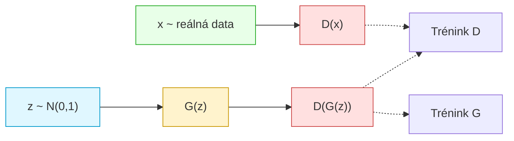
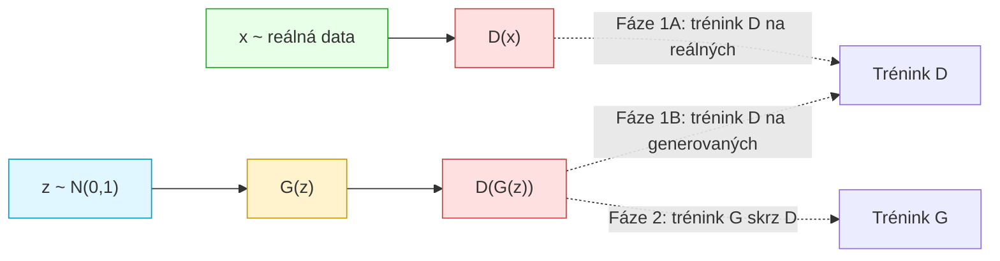

# GAN - Generative Adversarial Networks: vysvětlení a trénování

> **Cílem není vytvořit funkční produkční kód, ale spíše "vyprávět příběh" o tom, jak základní GAN sítě fungují uvnitř.**

## Úvod

Generative Adversarial Networks (GANy) jsou jedním z nejpopulárnějších a nejzajímavějších přístupů v moderní strojovém učení. Systém GAN je založen na **hře mezi neuronovými sítěmi**: generátorem, který se snaží vytvářet falešná data, a diskriminátorem, který se snaží mezi falešnými a reálnými daty rozlišovat.



---

## 1. Matematický základ: Vzorec Goodfellow (2014)

Základní vzorec pro GAN byl poprvé představen v původní práci:

```
min_G max_D V(D, G) = E[log D(x)] + E[log(1 - D(G(z)))]
```

### Vysvětlení jednotlivých částí

#### 1.1 Co znamená "max_D"?

**Diskriminátor chce maximalizovat hodnotu V.**

Diskriminátor je klasifikátor, kterému chceme, aby se dobře naučil rozlišovat reálná od falešných dat. V ideálním případě:

- **Reálná data (x):** Diskriminátor by měl vrátit D(x) = 1 (rozpozná, že je to originál)
- **Falešná data (G(z)):** Diskriminátor by měl vrátit D(G(z)) = 0 (rozpozná, že je to padělek)

#### 1.2 Dosazení do vzorce - ideální stav diskriminátora

Když dosadíme ideální hodnoty do vzorce V:

```
V = log(D(x)) + log(1 - D(G(z)))
V = log(1) + log(1 - 0)
V = 0 + log(1)
V = 0 + 0 = 0
```

**Maximální možná hodnota V je tedy 0** (protože logaritmy čísel menších než 1 jsou záporné čísla).

Cokoliv horšího než ideální stav diskriminátora má zápornou hodnotu (např. -1.02).

#### 1.3 Co znamená "min_G"?

**Generátor chce minimalizovat hodnotu V.**

Konkrétněji, generátor chce minimalizovat člen: `E[log(1 - D(G(z)))]`

Generátor se snaží donutit diskriminátor, aby se na falešná data mýlil – tedy aby si myslel, že jsou to reálná data.

#### 1.4 Ideální stav generátora

V ideálním případě by se generátor naučil vytvářet tak kvalitní falešná data, že by diskriminátor myslel D(G(z)) = 1 (myslí si, že je to originál).

Dosazením do vzorce:

```
log(1 - 1) = log(0) → -∞ (mínus nekonečno)
```

Protože se generátor snaží **minimalizovat** tuto funkci, je pro něj -∞ ideální – nejnižší možná hodnota.

---

## 2. Implementace v kódu: PyTorch a ztrátová funkce

### 2.1 Převod vzorce do optimizéru

V originálním vzorci se Diskriminátor snaží **maximalizovat** V. Avšak moderní optimizéry (jako Adam) jsou navrženy na **minimalizaci** chyb.

Proto používáme trik: **obracíme znaménko**

Místo:
- Šplhání z -1.02 nahoru k 0 (maximalizace)

Děláme:
- Padání z +1.02 dolů k 0 (minimalizace)

### 2.2 BCELoss (Binary Cross-Entropy Loss)

V PyTorch používáme `nn.BCELoss()`, která implementuje:

```
Loss = -[ y * log(p) + (1-y) * log(1-p) ]
```

Kde:
- `y` je cílová hodnota (0 nebo 1)
- `p` je předpověď modelu (hodnota mezi 0 a 1)

#### Pro diskriminátor:

Celková chyba diskriminátora je:
```
d_loss = Loss_real + Loss_fake
```

Tato chyba odpovídá oběm členům v originálním vzorci V(D, G).

#### Pro generátor:

V originálním vzorci se generátor snaží minimalizovat `log(1 - D(G(z)))`. Avšak toto má problém v praxi – podrobněji v sekci 3 (Saturace).

---

## 3. Kritický problém v praxi: Saturace gradientů

### 3.1 Co je saturace?

Na **začátku tréninku** je generátor velmi špatný. Diskriminátor proto vrací velmi nízké hodnoty: D(G(z)) ≈ 0.

Dosadíme do vzorce generátora:
```
log(1 - 0) = log(1) = 0
```

**Problém:** V oblasti, kde je výstup diskriminátoru na generovaných datech malý (D(G(z)) ≈ 0), má funkce log(1 - x) malý sklon (gradient). Saturace neplyne jen ze tvaru logaritmu, ale zejména ze saturace aktivační funkce v diskriminátoru, která poskytuje malé gradienty.

Graficky si to představte jako rovinu - generátor "neví", kterým směrem se zlepšit. Chyba je tak malá (0), že se back-propagation téměř neprojeví v aktualizacích vah. 

**Výsledek: Trénink stojí na místě!**

### 3.2 Řešení: Non-saturating loss trik

Místo abychom minimalizovali: `log(1 - D(G(z)))`

Raději **maximalizujeme**: `-log(D(G(z)))`

V kódu to znamená minimalizaci: `-log(D(G(z)))`

Non-saturating loss je také popsán už v původní GAN publikaci (Goodfellow 2014)

#### Srovnání na konkrétním příkladu

Představme si situaci v rané fázi tréninku, kde D(G(z)) = 0.01 (generátor je velmi špatný):

**Možnost A: Původní "Minimax" (saturating loss)**
```
Minimalizujeme:      log(1 - D(G(z)))
Hodnota:             log(1 - 0.01) = log(0.99) ≈ -0.01
Gradient (sklon):    Derivace log(1-x) v bodě 0.01 je MALÁ
Učení:               Generátor se učí velmi POMALU → SATURACE
```

**Možnost B: "Non-saturating" trik (doporučeno)**
```
Minimalizujeme:      -log(D(G(z)))
Hodnota:             -log(0.01) ≈ 4.60
Gradient (sklon):    Derivace -log(x) v bodě 0.01 je OBROVSKÁ
Učení:               Generátor se učí okamžitě a RYCHLE
```

#### Proč funguje trik?

Funkce `-log(x)` má v bodě x=0.01 velmi **strmý sklon** (gradient). To znamená, že když je generátor špatný (malý x), dostane velkou penalizaci (4.60 místo 0.01), a proto se odezvou na tuto penalizaci začne velmi rychle měnit.

Graficky: Místo plochého povrchu (malý sklon → bez učení), dostaneme prudký kopec (velký sklon → rychlé učení).

---

## 4. Algoritmus tréninku: Fáze diskriminátora a generátora

### Předpoklady

Předpokládáme, že již máme vytvořeny dva modely v PyTorch:
- `discriminator` - neurální síť pro klasifikaci
- `generator` - neurální síť pro generování

Definujeme:
```python
loss_function = nn.BCELoss()
d_optimizer = torch.optim.Adam(discriminator.parameters(), lr=0.0002)
g_optimizer = torch.optim.Adam(generator.parameters(), lr=0.0002)
```

### Pseudokód tréninku



#### FÁZE 1: Trénování diskriminátora (učí se poznat rozdíly)

**Cíl:** Diskriminátor by měl lépe rozlišovat reálná a falešná data.

##### Krok 1A: Učíme se na reálných datech

```python
outputs_real = discriminator(real_images)
d_loss_real = loss_function(outputs_real, real_labels)  # real_labels = 1
```

Diskriminátor vidí skutečné obrázky a měl by vrátit hodnoty blízké 1.

##### Krok 1B: Učíme se na falešných datech

```python
noise = torch.randn(batch_size, 100)
fake_images = generator(noise)
outputs_fake = discriminator(fake_images)

# DŮLEŽITÉ: Používáme .detach()
# Tím se gradienty propagují pouze do diskriminátora, ne do generátoru
d_loss_fake = loss_function(outputs_fake.detach(), fake_labels)  # fake_labels = 0
```

Generátor vytvoří falešné obrázky a diskriminátor by měl vrátit hodnoty blízké 0.

**Poznámka o `.detach()`:** 
V reálné implementaci používáme `fake_images.detach()`, aby se gradientní informace **nepropagovaly zpět do generátoru**. Chceme, aby se v Fázi 1 upravovaly pouze váhy diskriminátora. Bez `.detach()` by se diskriminátor učil "nařizovat" generátoru, jak má vypadat, místo aby se sám naučil je rozlišovat.

##### Krok 1C: Zpětné šíření a optimalizace diskriminátora

```python
d_loss = d_loss_real + d_loss_fake

d_optimizer.zero_grad()  # Vynuluj staré gradienty
d_loss.backward()         # Vypočítej nové gradienty
d_optimizer.step()        # Updatuj váhy diskriminátora
```

Diskriminátor se naučil z obou druhů dat. Jeho chyba je součet chyb z reálných a falešných dat.

---

#### FÁZE 2: Trénování generátora (učí se podvádět)

**Cíl:** Generátor by měl vytvářet lepší falešná data, která by oklamala diskriminátor.

##### Krok 2A: Generátor vytvoří nová falešná data

```python
noise_2 = torch.randn(batch_size, 100)
fake_images_2 = generator(noise_2)
```

Generátor dostane náhodný šum a má jej transformovat na co nejrealističtější obrázek.

##### Krok 2B: Diskriminátor ohodnotí falešná data

```python
outputs_fake_2 = discriminator(fake_images_2)
```

Diskriminátor "recenzuje" generované obrázky.

##### Krok 2C: Trik - používáme non-saturating loss

```python
g_loss = loss_function(outputs_fake_2, real_labels)  # real_labels = 1!
```

**To je ten klíčový trik:** Generátor chce, aby diskriminátor řekl "1" (myslel si, že je to originál).

BCELoss s `real_labels = 1` a předpovědí `outputs_fake_2 = p` se vypočítá jako:
```
L = -[ 1 * log(p) + (1-1) * log(1-p) ]
L = -log(p)
```

To je přesně to, co chceme - **non-saturating loss** pro generátor!

##### Krok 2D: Zpětné šíření a optimalizace generátora

```python
g_optimizer.zero_grad()   # Vynuluj staré gradienty
g_loss.backward()          # Vypočítej gradienty (tentokrát pro generátor)
g_optimizer.step()         # Updatuj váhy generátora
```

Generátor se aktualizuje na základě toho, jak si diskriminátor vedl. Pokud se diskriminátor nechal oklamat (vysoká předpověď), chyba je malá a generátor se jen mírně změní. Pokud diskriminátor poznal padělek (nízká předpověď), chyba je velká a generátor se výrazně změní.

---

## 5. Shrnutí trénovacího procesu

### Iterační cyklus

```
OPAKUJ:
  ├─ FÁZE 1: Trénuj DISKRIMINÁTOR
  │  ├─ Spusť reálné obrázky → cíl = 1
  │  ├─ Spusť generované obrázky → cíl = 0
  │  └─ Optimalizuj diskriminátor
  │
  └─ FÁZE 2: Trénuj GENERÁTOR
     ├─ Generuj nový batch obrázků
     ├─ Diskriminátor je ohodnotí
     └─ Optimalizuj generátor (cíl = 1, abys oklamal diskriminátor)
```

### Průběh tréninku

1. **Počáteční fáze:** Diskriminátor se rychle učí rozlišovat velmi špatné padělaní.
2. **Střední fáze:** Generátor se začíná zlepšovat, diskriminátor stále dominuje.
3. **Pozdní fáze:** Obě sítě se "dohadují" - generátor vytváří realističtější data, diskriminátor se zlepšuje v jejich detekci.
4. **Ideální konvergence:** Obě sítě dosahují rovnováhy - generátor vytváří data nerozlišitelná od reálných, diskriminátor má přesnost ~50% (nemůže je rozlišit).

Separací fází zajistíme, že každá síť dostane dostatek času na učení se ze své perspektivy.
---


## Závěr

GANy reprezentují fascinující paradigma v hlubokém učení, kde si dvě sítě navzájem "dělají konkurenci" a společně dosahují pozoruhodných výsledků. Zatímco základní koncept je elegantní, reálná implementace vyžaduje pečlivé ladění hyperparametrů, vhodnou volbu architektur a často pokročilejší techniky stabilizace tréninku.

Základní GANy jsou obtížné na trénování a mohou trpět:
- **Mode collapse:** Generátor vytváří omezený rozsah vzorů
- **Vanishing gradients:** Diskriminátor je příliš dobrý, generátor se nemá čeho chytit
- **Oscilace:** Chyby se neustále zvyšují a snižují

Na řešení těchto problémů se zaměřují pokročilejší varianty: 
- WGAN – nahrazuje BCE loss Wassersteinovou vzdáleností
- PGGAN – řeší stabilitu u velkých rozlišení
- BigGAN – řeší škálování na rozsáhlé datasety
- Self-Attention GAN –  přidává do sítí self‑attention vrstvy
