# Human Pose Estimation Methods (work-in-progress version)
---
| Method | Year | Category | Key Features | Source |
| :-- | :-- | :-- | :-- | :-- |
| DeepPose | 2014 | Coordinate regression | First to use a CNN to directly regress joint coordinates | https://arxiv.org/abs/1312.4659 |
| Convolutional Pose Machines | 2016 | Heatmap cascades | Iterative refinement via sequential CNN stages | https://arxiv.org/abs/1602.00134 |
| Stacked Hourglass Networks | 2016 | Heatmap encoder–decoder | Multi-scale feature extraction with repeated bottom-up/top-down | https://arxiv.org/abs/1603.06937 |
| OpenPose | 2017 | Bottom-up | Part Affinity Fields for grouping joints into individuals | https://arxiv.org/abs/1701.01779 |
| Lightweight OpenPose | 2018 | Bottom-up | MobileNet | https://arxiv.org/pdf/1811.12004 |
| VNect | 2017 | Heatmaps | The first real-time method to capture the full global 3D skeletal pose of a human | https://arxiv.org/abs/1705.01583 |
| SimpleBaseline | 2018 | Heatmaps | ResNet backbone with lightweight deconvolutional head | https://arxiv.org/abs/1804.06208 |
| PifPaf | 2019 | Bottom-up | Part Intensity Field (PIF) + Part Association Field (PAF) | https://arxiv.org/abs/1903.06593 |
| HRNet | 2019 | Heatmaps | Maintains high-resolution representations throughout the network | https://arxiv.org/abs/1902.09212 |
| PoseFormer | 2021 | Transformer-based | Models joint dependencies via self-attention on image tokens | https://arxiv.org/abs/2103.10455 |

| Survey | Year | Source |
| :-- | :-- | :-- |
| Recent Advances in Monocular 2D and 3D Human Pose Estimation: A Deep Learning Perspective| 2020 | https://arxiv.org/pdf/2104.11536 |
| 2D Human Pose Estimation: A Survey | 2022 | https://arxiv.org/abs/2204.07370 |
| Deep Learning-Based Human Pose Estimation: A Survey | 2020   2023 | https://arxiv.org/abs/2012.13392 |
| Human Pose Estimation Using Deep Learning: A Systematic Literature Review | 2023 | https://www.mdpi.com/2504-4990/5/4/81 |

#### The following figures and texts are taken from the publications listed above and below.

## Introduction

Pose detectors using images enable to create applications by analyzing human body keypoints in different areas: 
- Sports & Fitness
- Surveillance
- Entertainment

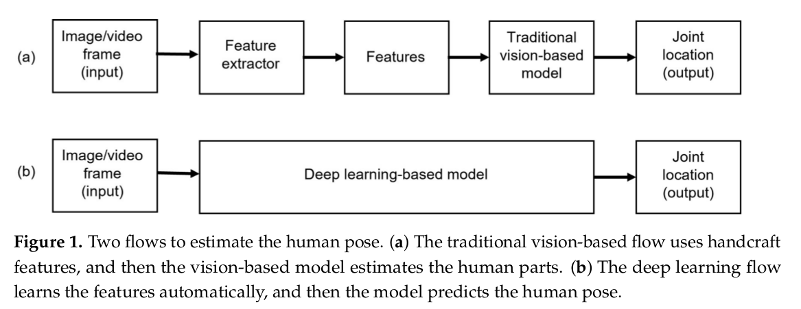

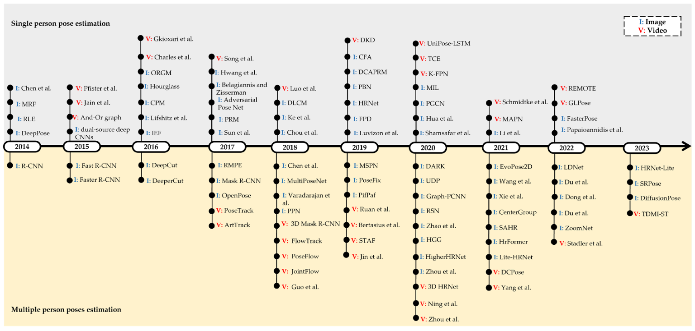

#### In general, the methods can be divided into several categories based on their core properties.

### Detection-Based Methods

- Represent keypoints as 2D Gaussian heatmaps
- The total number of heatmaps equals the total number of joints

### Regression-Based Methods

- Directly regress keypoint coordinates from image features

### Top-Down Methods

- First detect individuals in the image using human detectors
- Then estimate the pose for each detected person independently

### Bottom-Up Methods

- Detect all keypoints in the image first
- Then group keypoints into individual poses/skeletons

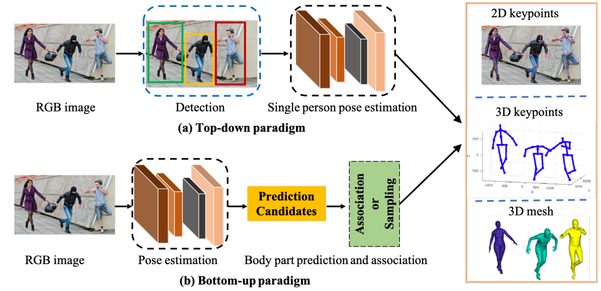

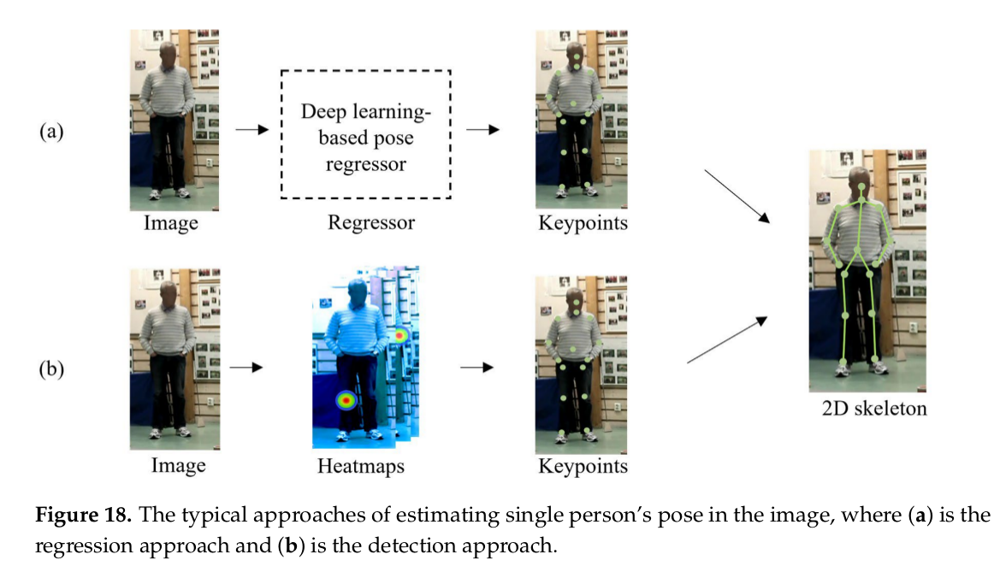

#### Examples of the output of these methods

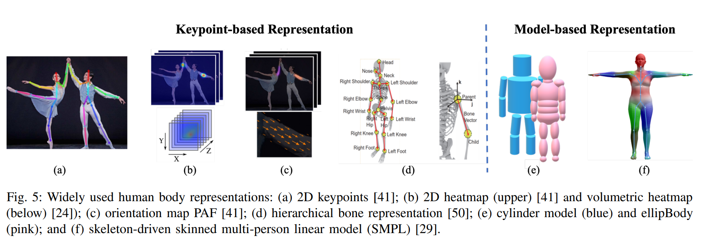

## Deep Pose (2014) https://arxiv.org/pdf/1312.4659

DeepPose is the first work to successfully apply deep neural networks to the full problem of human pose estimation in images, treating it as a regression task and using cascaded CNNs for refinement. 

> "We formulate the pose estimation as a joint regression problem and show how to successfully cast it in DNN settings. The location of each body joint is regressed to using as an input the full image and a 7-layered generic convolutional DNN."

> "Instead of a classification loss, we train a linear regression on top of the last network layer to predict a pose vector by minimizing
L2 distance between the prediction and the true pose vector."

> " In order to achieve better precision, we propose to train a cascade of pose regressors. At the first stage, the cascade starts off by estimating an initial pose as outlined in the previous section. At subsequent stages, additional DNN regressors are trained to predict a displacement of the joint locations from previous stage to the true location. Thus, each subsequent stage can be thought of as a refinement of the currently predicted pose, as shown in Fig. 2."

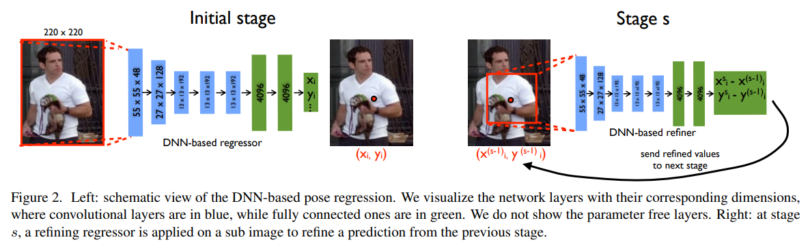

## Convolutional Pose Machines (2016) https://arxiv.org/pdf/1602.00134

The paper Convolutional Pose Machines introduces a multi-stage neural architecture for human pose estimation, combining convolutional networks with a sequential prediction framework to model spatial relationships between body parts.

> "CPMs consist of a sequence of convolutional networks that repeatedly produce 2D belief maps for the location of each part. At each stage in a CPM, image features and the belief maps produced by the previous stage are used as input."

> "Instead of explicitly parsing such belief maps either using graphical models or specialized post-processing steps, we learn convolutional networks that directly operate on intermediate belief maps and learn implicit image-dependent spatial models of the relationships between parts."

> "The belief maps from the first stage are generated from a network that examined the image locally with a small receptive field. In the second stage, we design a network that drastically increases the equivalent receptive field."

## Open-Pose (2018) https://arxiv.org/abs/1812.08008

- The earlier version of the OpenPose method was presented in https://arxiv.org/pdf/1611.08050
- The following version that makes several new contributions was presented in https://arxiv.org/abs/1812.08008 

The OpenPose method is typical representative of the bottom-up approach.
The OpenPose method uses the first 10 layers of VGG-19 as a feature extractor.

> "Fig. 2 illustrates the overall pipeline of our method. The system takes, as input, a color image of size w × h (Fig. 2a)
and produces the 2D locations of anatomical keypoints for  each person in the image (Fig. 2e). First, a feedforward
network predicts a set of 2D confidence maps S of body part locations (Fig. 2b) and a set of 2D vector fields L of
part affinity fields (PAFs), which encode the degree of association between parts (Fig. 2c). Finally, the confidence maps
and the PAFs are parsed by greedy inference (Fig. 2d) to output the 2D keypoints for all people in the image."

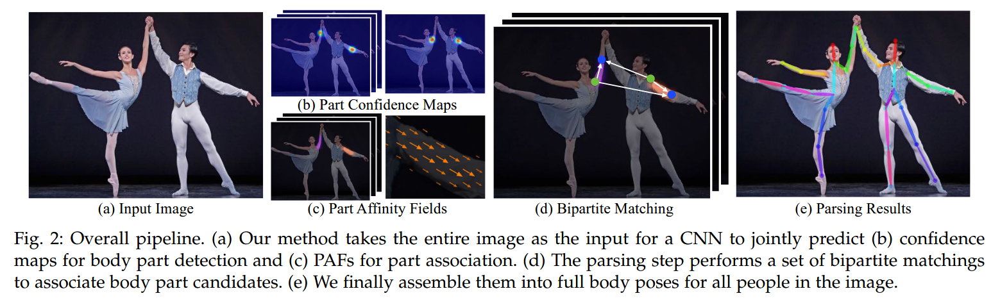

> "Our architecture, shown in Fig. 3, iteratively predicts affinity fields that encode part-to-part association, shown in blue,
and detection confidence maps, shown in beige."

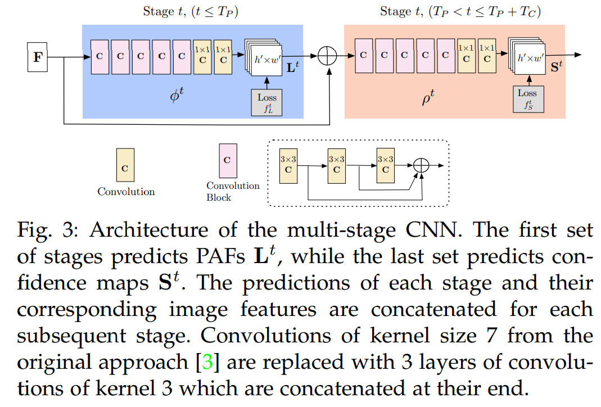

## Real-time 2D Multi-Person Pose Estimation on CPU: Lightweight OpenPose (2018) https://arxiv.org/abs/1811.12004

> "In our work we optimize the popular method OpenPose; The original implementation uses VGG-19 backbone as a features extractor; We evaluated networks from MobileNet
family to replace the VGG feature extractor; To produce new estimation of keypoint heatmaps and pafs the refinement stage takes features from backbone, concatenated with previous estimation of keypoint heatmaps and pafs. Motivated by this fact we decided to share the most of computations between heatmaps and pafs and use single
prediction branch in initial and refinement stage. We share all layers except the two last, which directly produce keypoint heatmaps and pafs, see Fig. 2."

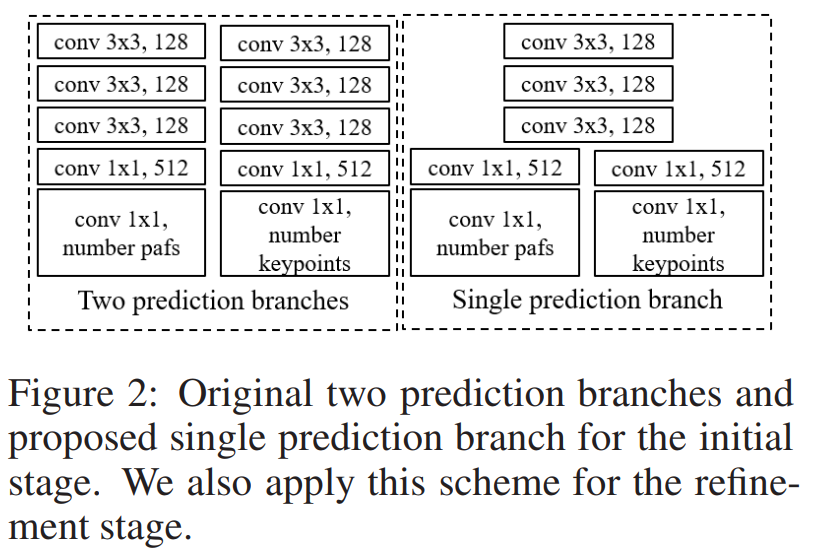

## PifPaf: Composite Fields for Human Pose Estimation (2019) https://arxiv.org/abs/1903.06593 

> "The new method, PifPaf, uses a Part Intensity Field (PIF) to localize body parts and a Part Association Field (PAF) to associate body parts with each other to form full human poses. Our method outperforms previous methods at low resolution and in crowded, cluttered and occluded scenes"

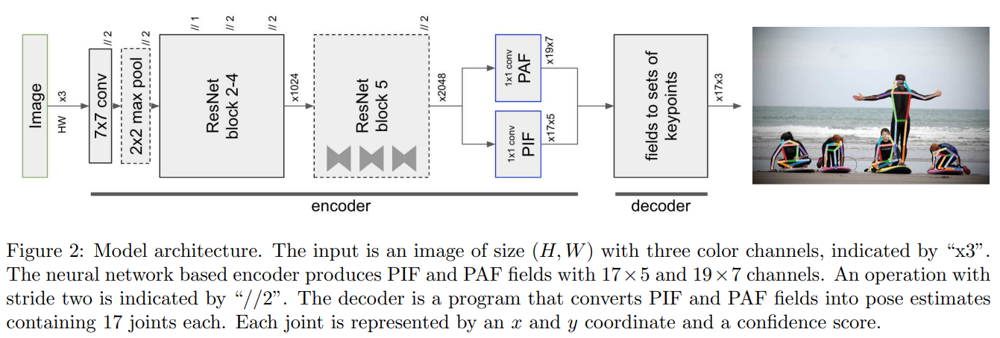

- Part Intensity Fields (PIF):
PIFs are used to detect and precisely localize body parts. Each PIF provides a confidence score, the exact coordinates of the body part, and an estimate of the joint size. This grid-free approach allows for high localization accuracy, even when people are close together or overlapping.

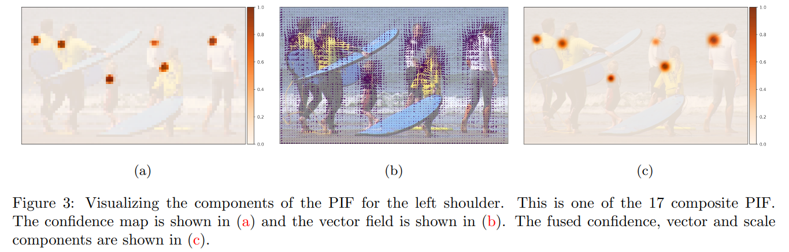

- Part Association Fields (PAF):
PAFs are vector fields that encode the associations between detected body parts, allowing the model to connect the correct joints to form individual human poses. These fields help the algorithm determine which detected joints belong together, enabling accurate pose estimation for multiple people in the same image

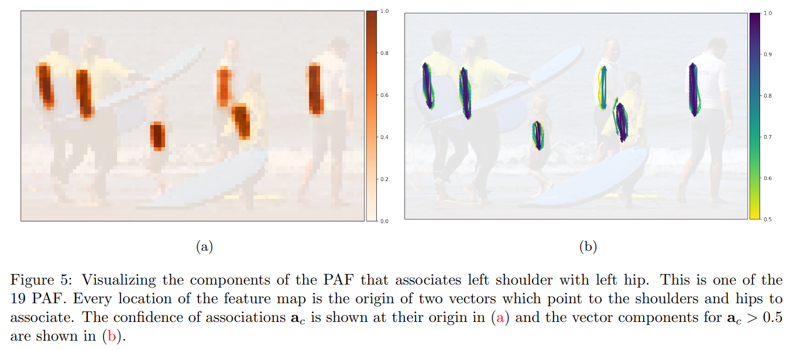

## Deep High-Resolution Representation Learning for Human Pose Estimation (2019) https://arxiv.org/pdf/1902.09212

> "We present a novel architecture, namely HighResolution Net (HRNet), which is able to maintain highresolution representations through the whole process. The resulting network is illustrated in Figure 1."

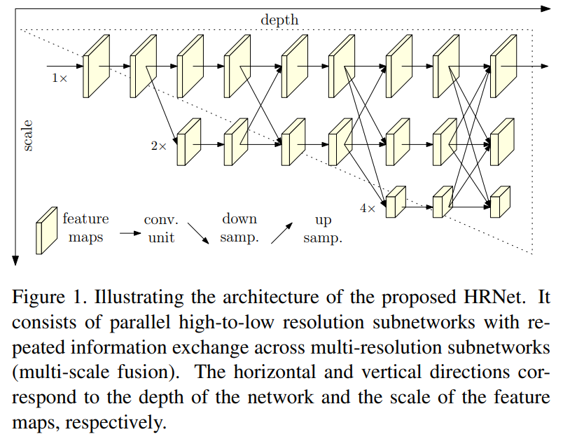

> "(i) Our approach connects high-to-low resolution subnetworks in parallel rather than in series as done in most existing solutions. Thus, our approach is able to maintain the high resolution instead of recovering the resolution through a low-to-high process, and accordingly the predicted heatmap is potentially spatially more precise."

> "(ii) Most existing fusion schemes aggregate low-level and highlevel representations. Instead, we perform repeated multiscale fusions to boost the high-resolution representations with the help of the low-resolution representations of the same depth and similar level, and vice versa, resulting in
that high-resolution representations are also rich for pose estimation. Consequently, our predicted heatmap is potentially more accurate."

## 3D Human Pose Estimation with Spatial and Temporal Transformers (2021) https://arxiv.org/pdf/2103.10455

> "In this work, we present PoseFormer, a purely transformer-based approach for 3D human pose estimation in videos without convolutional architectures involved. Inspired by recent developments in vision transformers, we design a spatial-temporal transformer structure to comprehensively model the human joint relations within each frame as well as the temporal correlations across frames, then output an accurate 3D human pose of the center frame. "

> "Spatial Transformer Module. The spatial transformer module is to extract a high dimensional feature embedding from a single frame."
> "Temporal Transformer Module. Since the spatial transformer module encodes high dimensional features for each individual frame, the goal for the temporal transformer
module is to model dependencies across the sequence of frames."

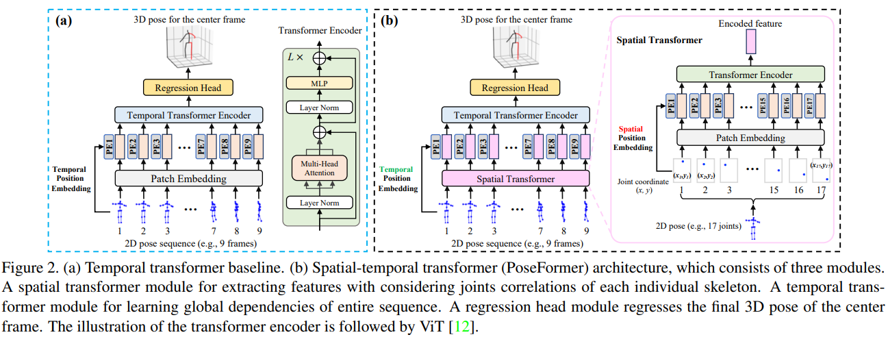
