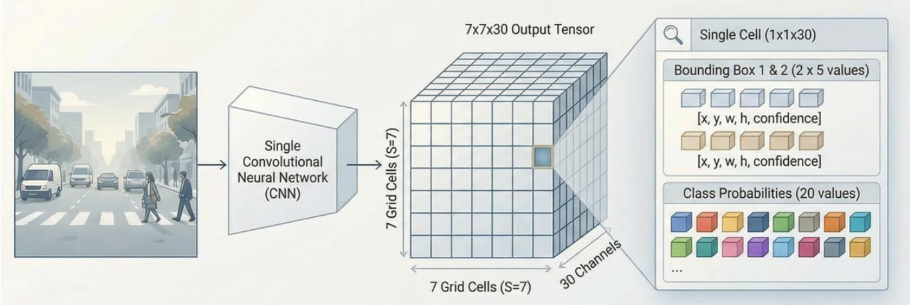
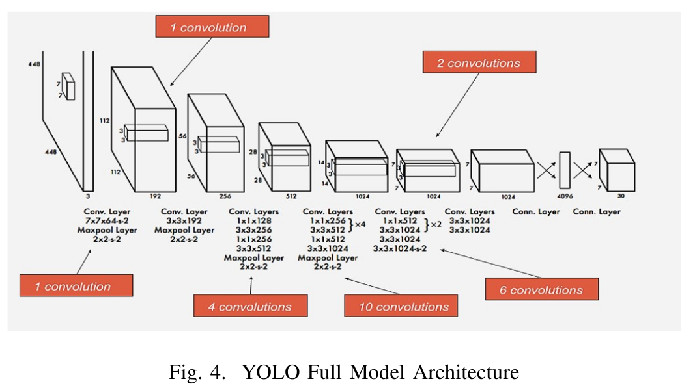
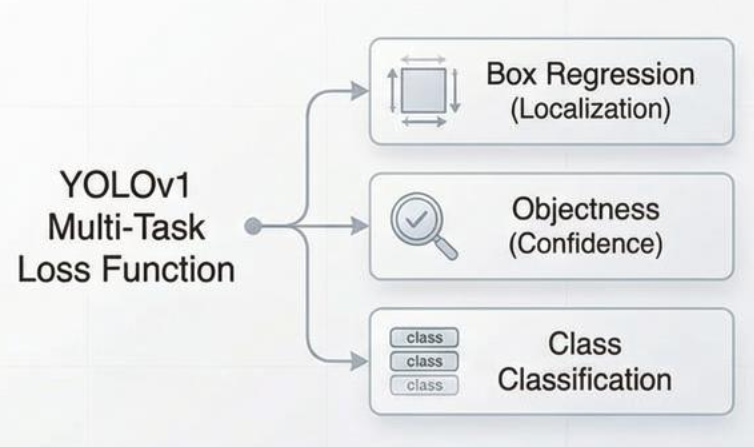
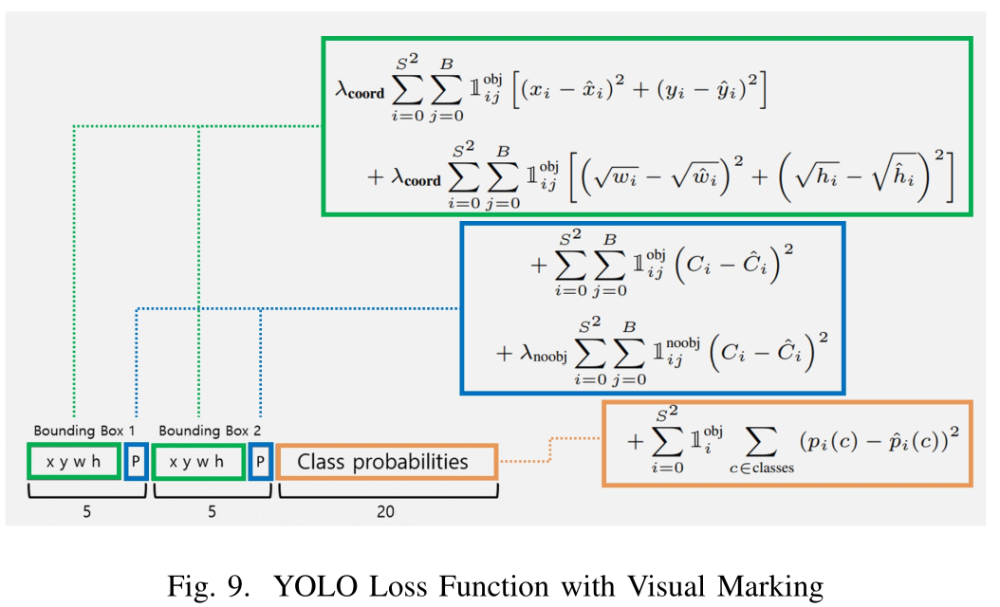
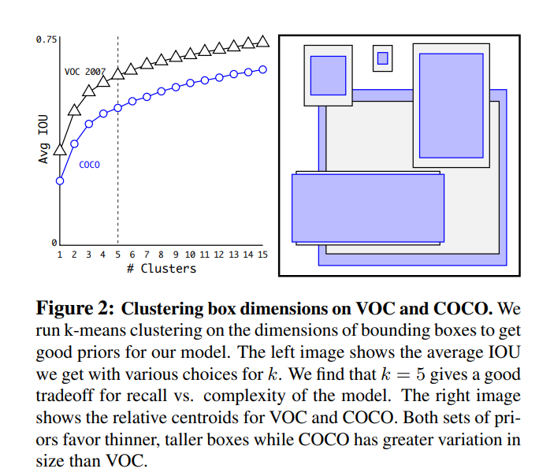
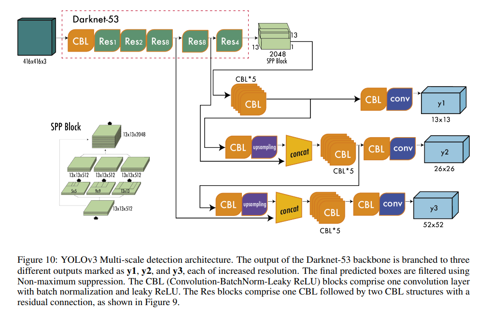

# Vysvětlení principu YOLOv1 + Evoluce YOLO detektorů

> **Cílem není vytvořit funkční produkční kód, ale spíše "vyprávět příběh" o tom, jak zejména YOLOv1 a navazující verze fungují uvnitř.**
> 
> *(Jedná se o pracovní verzi, proto prosím omluvte fakt, že se místy mohou objevit případné překlepy.)*
---

## 1. Hlavní myšlenka (Grid-First Approach)

YOLO se na obrázek dívá jako na **šachovnici** (mřížka buněk) a problém lokalizace řeší na úrovni jednotlivých buňek. Každá buňka této mřížky funguje jako samostatný detektor, který má za úkol predikovat B ohraničujících boxů (v YOLOv1 je B = 2).

<center>

</center>

### Princip mřížky

Vstupní obrázek se **virtuálně rozdělí** na mřížku SxS (např. 7×7). Toto rozdělení **není fyzické rozstříhání** obrázku, ale **logické rozdělení odpovědnosti**. 

Celá síť je trénována tak, aby pro každou z těchto **49 buněk** vyprodukovala předpověď. Je to jako **49 malých detektorů běžících najednou**.

### Porovnání s R-CNN

Na rozdíl od **R-CNN (Two-Stage)**, které nejdříve hledaly "zajímavá místa" a pak je klasifikovaly, **YOLO řeší vše najednou** (regrese souřadnic).

- **Vstupem** je obrázek
- **Výstupem** je tenzor [S, S, data]

| YOLO | R-CNN |
|------|-------|
| Řeší vše najednou (regrese souřadnic) | Dvoustupňový přístup |
| Vstupem: obrázek → Výstup: tenzor [S, S, data] | Nejdříve hledá zajímavá místa, pak klasifikuje |

---

## 2. Co síť vidí (Receptive Field vs. Grid)

Díky **hluboké konvoluční síti** (backbone, např. VGG) má **každý neuron ve výstupní mřížce (7×7) informace z celého obrázku** (nebo jeho podstatné části).

> ⚠️ **POZOR**: I když buňka [0,0] (vlevo nahoře) odpovídá za levý horní roh, technicky "vidí" i kontext z jiné části obrazu.

Toto je klíčové - neuron v mřížce má **receptivní pole** (receptive field), které pokrývá velkou část vstupu. Díky tomu může síť vidět celou sadu kontextu i když se "soustředí" na jednu buňku.

---

## 3. Rozdělení odpovědnosti

Aby se detektory v buňkách nehádaly ("Já to vidím!" - "Já taky!"), YOLO zavádí **striktní pravidlo**:

**"Za objekt je zodpovědná POUZE ta buňka, do které padne STŘED objektu."**

Praktické důsledky:
- Objekt přesahující 4 buňky? → Učí se ho **jen ta jedna se středem**
- Ostatní buňky jsou **ignorovány**, i když objekt vidí
- To **nutí síť** naučit se přesně lokalizovat střed objektu

Toto omezení je v YOLOv1 poměrně svazující - v pozdějších verzích se to autoři snaží postupně řešit (anchor boxes ve v2, multi-scale predictions ve v3).

---

## 4. Co po síti chceme?

Pro každou buňku (i, j) chceme predikovat **vektor hodnot**, který obsahuje:

- **Informace o Boxech**: (x, y, w, h, confidence)
- **Informace o Třídě**: pravděpodobnosti pro každou kategorii

### Příklad: Dataset PASCAL VOC

| Parametr | Hodnota |
|----------|---------|
| Počet tříd | 20 (Pes, Kočka, Auto...) |
| Boxů na buňku | 2 (B=2) |
| Box parametry | 5 (x, y, w, h, confidence) |
| Vektor struktura | [Box1 (5)] + [Box2 (5)] + [Classes (20)] |
| Celková délka vektoru | 5 + 5 + 20 = **30 hodnot** |
| Výstupní tenzor | **[Batch, 7, 7, 30]** |

Každá buňka je tedy odpovědná za výstup 30 hodnot:
- Prvních 5 hodnot popisuje **Box 1**
- Následujících 5 hodnot popisuje **Box 2**
- Zbylých 20 hodnot reprezentuje **třídy** (v YOLOv1 jsou společné pro oba boxy!)

---

## 5. Jak se pozná pozadí? (Žádná extra třída)

- **YOLOv1 NEMÁ speciální třídu "Background"**
- Pokud buňka **neobsahuje střed objektu** (je to jen strom/obloha), učíme síť predikovat **Confidence = 0** pro oba boxy
- Hodnota "Class" nás v takovém případě **nezajímá** a v Loss funkci se **ignoruje**

To znamená, že síť se sama učí rozpoznat rozdíl mezi "zde je objekt" (high confidence) a "zde není objekt" (low confidence).

---

## 6. Legenda k hodnotám v boxu

| Parametr | Vysvětlení |
|----------|-----------|
| **x, y** | Pozice středu relativně vůči **levému hornímu rohu buňky** (0-1) |
| **w, h** | Velikost objektu relativně vůči **celému obrázku** (0-1) |
| **confidence** | Jak moc si je síť jistá, že zde má být objekt A jak dobře tam její box sedí (0-1) |

### Detailnější vysvětlení confidence

- V tréninku se učí jako IoU (Intersection over Union) mezi předpovídaným boxem a ground truth boxem
- V inferenci se používá k filtrování slabých detekcí
- Hodnota 0.8 znamená: jak moc síť věří, že v tomhle boxu je nějaký objekt a že ten box dává smysl
- Formálně se confidence učí regresí na hodnotu IoU (u buněk s objektem) nebo 0 (u pozadí); intuitivně ji můžeme číst jako kombinaci jistoty, že tu objekt je, a kvality překryvu.
---

# Ukázka YOLOv1 modelu s VGG + pseudokód v PyTorch
- Diagram originální sítě je ukázan níže, zde v pseudokódu je pro jednoduchost/názornost použit již existující VGG16 model z torchvision 

### Část 1: Inicializace + definice modelu (Backbone + Head)

```python
import torch
import torch.nn as nn
import torchvision.models as models

class YOLOv1Simple(nn.Module):
    def __init__(self, n_classes=20, B=2):
        super(YOLOv1Simple, self).__init__()
        
        # Konfigurace mřížky
        self.S = 7           # Grid size (7×7 buňek)
        self.B = B           # Počet boxů na buňku (2 v originálním paperu)
        self.C = n_classes   # Počet tříd (20 pro PASCAL VOC)
```

**Vysvětlení konfigurační části:**
- `S = 7`: Vstupní obrázek se dělí na 7×7 = 49 buněk
- `B = 2`: Každá buňka predikuje 2 bounding boxy (můžeme vybrat ten lepší)
- `C = 20`: PASCAL VOC dataset má 20 tříd (pes, kočka, auto, atd.)

### Část 2: Backbone (pro ukázku s VGG16)

```python
        # 1. BACKBONE (VGG16 Features)
        # Vstup: [Batch, 3, 224, 224]
        # Výstup: [Batch, 512, 7, 7]
        vgg = models.vgg16(pretrained=True)
        self.features = vgg.features
        
        # Zmrazení vah backbonu (volitelné - transfer learning)
        for param in self.features.parameters():
            param.requires_grad = False
```

**Proč YOLOv1 přešlo na velikost obrazu 448×448?**
- Detekce objektů vyžaduje jemnější detaily než klasifikace
- Klasifikace řeší "co to je", detekce řeší "kde to je a jak velké to je"
- Ale v tomto pseudokódu používáme 224×224 pro jednoduchost/ukázku

**Zmrazení vah (Transfer Learning):**
```python
param.requires_grad = False  # Tyto váhy se nebudou učit
```
- Často je možné zmrazit váhy a učit pouze "detection head"
- Tímto uspoříme čas tréninku
- Síť (např. VGG) už ví, co jsou "objekty", my ji jen učíme, **kde** jsou

### Část 3: Výpočet dimenzí

```python
        # Výpočet velikosti vstupu do Linear vrstvy
        # VGG features dávají 512 kanálů × 7 šířka × 7 výška
        self.flatten_dim = 512 * 7 * 7  # = 25,088 neuronů
        
        # Výpočet velikosti výstupu
        # (7×7 mřížka) × (B×5 + C)
        # Pro VOC dataset: 49 × (2×5 + 20) = 49 × 30 = 1470 neuronů
        self.output_dim = self.S * self.S * (self.B * 5 + self.C)
```

**Matematika:**

**Flatten dimension:**
- VGG feature output: [Batch, 512 kanálů, 7 pixelů, 7 pixelů]
- Když "sploštíme" (flatten): [Batch, 512 × 7 × 7] = [Batch, 25088]
- 25088 je vstup do první fully connected vrstvy

**Output dimension:**
- Chceme 7×7 = 49 buněk
- Každá buňka má:
  - Box 1: 5 hodnot (x, y, w, h, confidence)
  - Box 2: 5 hodnot (x, y, w, h, confidence)
  - Třídy: 20 hodnot (p_dog, p_cat, ..., p_person)
  - **Celkem: 5 + 5 + 20 = 30 hodnot na buňku**
- Celkový výstup: 49 × 30 = 1470 hodnot
- Toto musíme "rozbít" zpět na [7, 7, 30]

### Část 4: Detection Head (Fully Connected vrstvy)

```python
        # 2. DETECTION HEAD (Fully Connected)
        self.classifier = nn.Sequential(
            nn.Flatten(),
            # První FC vrstva (v paperu 4096 neuronů)
            nn.Linear(self.flatten_dim, 4096),  # 25088 → 4096
            nn.LeakyReLU(0.1, inplace=True),
            nn.Dropout(0.5),
            # Druhá FC vrstva (výstupní)
            nn.Linear(4096, self.output_dim)     # 4096 → 1470
        )
```

**Vysvětlení:**

1. **nn.Flatten()**: Převede [Batch, 512, 7, 7] → [Batch, 25088]

2. **nn.Linear(25088, 4096)**:
   - Redukuje dimenzi z 25088 na 4096
   - Tímto "komprimujeme" informaci - učíme se nejdůležitější rysy
   - Redukce z 25088 na 4096 je přibližně 6× komprese

3. **nn.LeakyReLU(0.1)**:
   - Aktivační funkce - přidává nelinearitu
   - LeakyReLU: pokud x < 0, vrací 0.1 × x (místo 0)
   - Pomáhá s gradient flow v zpětné propagaci

4. **nn.Dropout(0.5)**:
   - Během tréninku: náhodně "vypíná" 50% neuronů
   - Během testování: bez efektu
   - Regulárizuje model - zamezuje overfittingu

5. **nn.Linear(4096, 1470)**:
   - Finální výstup - 1470 hodnot (jak jsme spočítali)

### Část 5: Forward Pass

```python
    def forward(self, x):
        # 1. Extrakce příznaků
        # x: [Batch, 3, 224, 224] -> [Batch, 512, 7, 7]
        x = self.features(x)
        
        # 2. Regrese / Klasifikace
        # [Batch, 25088] -> [Batch, 1470]
        x = self.classifier(x)
        
        # 3. Reshape zpět na mřížku
        current_batch_size = x.size(0)
        # [Batch, 1470] -> [Batch, 7, 7, 30]
        x = x.view(current_batch_size, self.S, self.S, 
                   (self.B * 5 + self.C))
        
        return x
```

**Vizualizace toku:**

```
Input: [32, 3, 224, 224]     (32 obrázků, 3 RGB kanály, 224×224 pixelů)
       ↓
VGG16 Features
       ↓
Output: [32, 512, 7, 7]      (512 feature map, 7×7 grid)
       ↓
Flatten: [32, 25088]
       ↓
FC1: [32, 4096]
       ↓
LeakyReLU + Dropout
       ↓
FC2: [32, 1470]              (1470 = 7×7×30)
       ↓
Reshape: [32, 7, 7, 30]      (každá buňka má 30 hodnot)
       ↓
Return
```

### Příklad použití

```python
if __name__ == "__main__":
    model = YOLOv1Simple(n_classes=20, B=2)
    dummy = torch.randn(1, 3, 224, 224)
    out = model(dummy)
    
    print("Výstup:", out.shape)  # torch.Size([1, 7, 7, 30])
    
    # Extrakce dat z buňky [3, 3]
    cell = out[0, 3, 3]  # Batche 0, řádek 3, sloupec 3
    
    print("Box1:", cell[0:5].detach().numpy())    # [x, y, w, h, conf]
    print("Box2:", cell[5:10].detach().numpy())   # [x, y, w, h, conf]
    print("Třídy:", cell[10:].detach().numpy())   # [p1, p2, ..., p20]
```

**Vysvětlení extrakcí:**
- Box1 je prvních 5 hodnot, Box2 dalších 5, poté 20 tříd

---

# Originální model YOLOv1

<center>

</center>

---

# YOLOv1 Ztrátová funkce

## Základní pohled

<center>

</center>


Ztrátová funkce YOLOv1 se skládá z částí, které měří různé typy chyb:

### 1. Chyba pozice a velikosti
- Měří rozdíl mezi **předpovězenými souřadnicemi** rámečku (x, y, w, h) a **skutečnými** souřadnicemi
- Model se učí, jak **přesně umístit rámeček** kolem objektu
- Toto je regresní problém - chceme, aby souřadnice byly co nejblíže skutečnosti

### 2. Chyba confidence
- Měří, jak dobře model **odhaduje kvalitu** své predikce
- Během tréninku se model učí predikovat hodnotu, která odpovídá **překryvu (IoU)** s reálným objektem
- Při testování slouží confidence k **filtrování detekcí** a výběru nejlepších rámečků pomocí NMS (Non-Maximum Suppression)
- Confidence je klíčové pro praxi - bez toho nevíme, kterým boxům věřit

### 3. Chyba klasifikace
- Měří, jak **přesně** model určil třídu objektu
- Počítá se **pouze pro buňky** obsahující objekt
- Pokud v buňce není objekt, třída nás nezajímá

**Minimalizace součtu těchto chyb vede k tomu, že model:**
- 🟢 Správně lokalizuje objekty (chyba pozice/velikosti)
- 🔵 Správně ohodnotí kvalitu predikcí (chyba confidence)
- 🟠 Správně je klasifikuje (chyba třídy)

<center>

</center>
  
## Podrobnější pohled - 5 komponent

Ztrátová funkce YOLOv1 používá **SSE (Sum of Squared Errors)** a sestává z **5 částí**, které je možné seskupit podle účelu:

### A) Chyba souřadnic (x, y)

```
loss_xy = λ_coord × ((x_pred - x_target)² + (y_pred - y_target)²)
```

**Vysvětlení:**
- Penalizuje odchylku středu předpovězeného boxu od skutečného středu
- Počítá se **pouze pro box** zodpovědný za daný objekt (má nejvyšší IoU s ground truth)
- λ_coord = 5.0 (váha) - tuto komponentu bereme vážně!

**Prakticky:**
- Pokud je objekt v buňce na pozici [0.5, 0.3] a model predikuje [0.4, 0.2]
- Chyba = (0.4 - 0.5)² + (0.2 - 0.3)² = 0.01 + 0.01 = 0.02
- Po vynásobení λ_coord = 5.0: loss = 0.1

### B) Chyba rozměrů (w, h)

```
loss_wh = λ_coord × ((√w_pred - √w_target)² + (√h_pred - √h_target)²)
```

**Vysvětlení:**
- Penalizuje rozdíl v **šířce a výšce**
- **Používá se odmocnina**

**Proč odmocnina?**

Představme si dva scénáře:
1. **Velký objekt**: Skutečná velikost 0.8×0.8, predikce 0.7×0.7
   - Bez odmocniny: (0.7 - 0.8)² = 0.01
   - S odmocninou: (√0.7 - √0.8)² ≈ 0.01 (podobně)

2. **Malý objekt**: Skutečná velikost 0.2×0.2, predikce 0.1×0.1
   - Bez odmocniny: (0.1 - 0.2)² = 0.01
   - S odmocninou: (√0.1 - √0.2)² ≈ 0.035 (VĚTŠÍ!)

**Důsledek:**
- Stejná absolutní chyba u malých objektů se penalizuje **více** než u velkých
- Požaduje se přesnost i na malých objektech

### C) Chyba Confidence PRO OBJEKTY

```
loss_obj = (conf_pred - IoU_score)²
```

**Vysvětlení:**
- Počítá se pro **boxy detekující objekt** (v buňce je objekt a box je zodpovědný)
- Cílová hodnota confidence = **IoU** mezi předpovězeným a skutečným boxem
- Model se učí **odhadovat kvalitu** svého boxu

**Detailněji:**

IoU (Intersection over Union):
```
IoU = Area(Predicted ∩ Ground Truth) / Area(Predicted ∪ Ground Truth)
```

Příklady:
- Dokonalá predikce: IoU = 1.0 → target confidence = 1.0
- Částečné překrytí (50%): IoU = 0.5 → target confidence = 0.5
- Chybná predikce (bez překrytí): IoU = 0 → target confidence = 0

**Proč?**
- Model se učí, jaká predikce je dobrá (IoU) vs špatná
- V inferenci: confidence > 0.5 znamená "věřím tomu boxu"

### D) Chyba Confidence PRO POZADÍ

```
loss_noobj = λ_noobj × (conf_pred - 0)²
```

**Vysvětlení:**
- Počítá se pro **boxy bez objektu** v buňkách
- Cílová hodnota = 0 (žádný objekt)
- Má **nižší váhu** (λ_noobj = 0.5), protože:
  - Většina buněk neobsahuje objekt (pozadí)
  - Bez redukce váhy by se síť "zaměřila" hlavně na predikování negativů
  - Pozitiva (objekty) by se ztratila v šumu

**Prakticky:**
- V obrázku 7×7 = 49 buněk
- Typicky jen 2-5 obsahuje objekt
- Ostatních 44+ buněk jsou "background" → jejich váha se redukuje

### E) Chyba Třídy

```
loss_class = (class_pred - class_target)²
```

**Vysvětlení:**
- Penalizuje **nesprávnou klasifikaci** objektu
- Počítá se **pouze pro buňky** obsahující objekt
- Jde o chybu v pravděpodobnosti jednotlivých tříd
- Pro každou třídu se měří chyba mezi předpovězenou a skutečnou pravděpodobností

## Váhy ve ztrátové funkci - interpretace

```python
class YOLOv1Loss(nn.Module):
    def __init__(self):
        super().__init__()
        
        # Větší váha pro chyby v (x,y,w,h)
        # Chceme přesnější lokalizaci
        # Chyby v lokalizaci bereme 5× vážněji
        self.lambda_coord = 5.0
        
        # Menší váha pro chyby confidence u buněk bez objektu
        # Aby přemíra pozadí "nepřehlušila" učení o objektech
        self.lambda_noobj = 0.5
    
    def forward(self, predictions, target):
        """
        Total Loss = λ_coord × loss_xy 
                   + λ_coord × loss_wh 
                   + loss_obj
                   + λ_noobj × loss_noobj
                   + loss_class
        """
```
**Praktický důsledek:**
- Model se "zaměřuje" na lokalizaci (5×)
- Ignoruje (relativně) pozadí (0.5×)

## Pseudokód ztrátové funkce

```python
def yolo_loss(predictions, targets):
    """
    predictions: [Batch, 7, 7, 30]  # (x, y, w, h, conf)×2 + 20 tříd
    targets: [Batch, 7, 7, 30]      # ground truth
    """
    
    # --- SOUŘADNICE XY --------------------------------------------------
    loss_xy = lambda_coord * SSE(x_pred - x_target, y_pred - y_target)
    
    # --- VELIKOST WH (s odmocninou!) --------------------------------
    loss_wh = lambda_coord * SSE(sqrt(w_pred) - sqrt(w_target), 
                                  sqrt(h_pred) - sqrt(h_target))
    
    # --- OBJECT LOSS ---------
    loss_obj = SSE(conf_pred - IoU_score)
    
    # --- NO OBJECT LOSS  ----
    loss_noobj = lambda_noobj * SSE(conf_pred - 0)
    
    # --- CLASS LOSS --------------------------------
    loss_class = SSE(class_probs_pred - class_probs_target)
    
    # --- TOTAL LOSS -------------------------------------------
    total_loss = loss_xy + loss_wh + loss_obj + loss_noobj + loss_class
    
    return total_loss
```

---

---

# Evoluce YOLO detektorů: YOLOv1 → YOLOv2 → YOLOv3

## YOLOv1 (2016)

### Princip

- Vstupní obrázek se **rozdělí na SxS mřížku buňek** (např. 7×7)
- Každá buňka predikuje:
  - **Geometrii boxu** (regrese) - x, y, w, h
  - **Confidence** (regrese) - jistota, že je zde objekt
  - **Třídy** (klasifikace) - co to je
- Výstup: **jeden průchod = jeden forward pass** (velmi rychlý průchod - charakteristika YOLO)

### Architektura páteře (Backbone)

- **Inspirace**: GoogleNet
- **Struktura**: 24 konvolučních vrstev + 2 plně propojené vrstvy (Dense/FC)
- **Vstupní rozměr**: 448×448 (původní paper)
  - Proč 448? Detekce objektů vyžaduje jemnější detaily než klasifikace
  - Klasifikace řeší "co to je", detekce řeší "kde to je a jak velké to je"

### Klíčové charakteristiky

| Vlastnost | Popis |
|-----------|--------|
| ✅ **Rychlost** | Jedna forward pass pro celý obrázek - velmi rychlé na CPU i GPU |
| ✅ **Přehledná architektura** | Relativně jednoduchý design - snadné porozumění |
| ❌ **Přesnost lokalizace** | Regrese souřadnic přímo je nestabilní - těžko se učí přesné umístění |
| ❌ **Malé objekty** | Mřížka 7×7 je příliš hrubá - malé objekty se ztrácejí |
| ❌ **Blízké objekty** | Pouze jeden objekt na buňku - pokud jsou dva objekty v jedné buňce, model vybere jen jeden |

### Omezení YOLOv1

Navrhovaná mřížka 7×7 se ukázala jako **velmi hrubá**, což byl jeden z hlavních důvodů, proč YOLOv1 **selhávalo na malých objektech**. V praktických testech mělo YOLOv1 horší výsledky na detekci malých objektů ve srovnání s dvoustupňovými metodami.

---

## YOLOv2 (2017)

### A) Batch Normalization

- Přidáno do **všech konvolučních vrstev**
- **Efekt**: +2% mAP (Mean Average Precision) jen z této jedné změny!
- Umožňuje **odstranit Dropout vrstvy** (už nejsou potřeba)
- **Stabilizuje trénink** - model se učí lépe a rychleji
- Batch Norm normalizuje vnitřní aktivace, což pomáhá např. s:
  - Zrychlením učení (vyšší learning rate)
  - Snížením sensitivity na inicializaci vah

### B) Anchor Boxes (Kotvící rámečky)

Toto byla zásadní **změna** ve verzi 2.

**Problém v YOLOv1:**
- Plně propojená vrstva predikovala souřadnice **přímo**
- ❌ Nestabilní - síť se musela naučit regresovat souřadnice "od nuly"
- ❌ Hůře se učí

**Řešení v YOLOv2:**
- Inspirace: **Faster R-CNN**
- Pro každou buňku v mřížce se **předdefinuje N "kotev"** (anchors)
- Kotva = předdefinovaný tvar/poměr stran (**aspect ratio**)
- Síť nyní **NEPREDIKOVÁVÁ souřadnice přímo**, ale **RELATIVNÍ ÚPRAVY** k těmto kotvám:
  - Δx, Δy, Δw, Δh (adjustments)
  - Confidence
  - Class probabilities
- **Výhoda**: Síť se učí hledat, co **věděla, že existuje** = **stabilnější trénink**

**Jak to funguje v praxi:**
1. Síť vidí obrázek
2. Pro každou kotvu v každé buňce predikuje: "jak moc se tato kotva má posunout/zvětšit/zmenšit"
3. Malé úpravy jsou snadnější se učit než regrese z nuly

### C) K-Means Clustering

**Problém:** Jaké kotvy zvolit? Jak vědět, jaké poměry stran budou optimální?

**Řešení:**
1. Spusť **k-means clustering** na všech ground-truth bounding boxech v trénovacím datasetu
2. Zjisti, jaké **poměry stran a velikosti** jsou nejčastější
3. Použij tyto jako **"priors"** (5 kotev pro YOLOv2)
4. Síť se tak učí na **empirických datech ze svého datasetu**

**Výhoda**: 
- **Data-driven approach** - kotvy odpovídají datům
- Model se nemusí učit "základní" tvary objektů, už je "zná"
- Lepší výchozí bod pro trénink

<center>

</center>

### D) Multi-Scale Trénování

- **YOLOv2 je plně konvoluční** (bez Dense vrstev → variabilní vstup)
- Během tréninku se **každých 10 iterací změní vstupní rozlišení**:
  - {320×320, 352×352, ..., 608×608}
- Síť se **učí detekovat objekty** při různých zoom-levelech
- **Výsledek**: 
  - Vyšší robustnost vůči různým velikostem objektů
  - Model se lépe generalizuje
  - Bez toho by model pracoval dobře jen na jednom rozlišení

**Prakticky:** Během jedné epochy:
- Prvních N iterací na 320×320 - malé objekty, širší kontext
- Dalších N iterací na 352×352 - středně-velké objekty
- Atd. až po 608×608 - velké objekty, detaily

Toto je forma **data augmentation** - ale důležitá pro detekci.

### E) Páteřní Síť: Darknet-19

- **19 konvolučních vrstev** + 5 pooling vrstev
- Inspirace: VGG (ale lehčí a efektivnější)
- Výstupní mřížka: **13×13 buněk** (při 416×416 vstupu)
- Menší než YOLOv1 (24 vrstev), ale s chytřejší architekturou

**Poznámka:** YOLOv2 se také nazývá **"YOLO9000"** - pojmenování pochází z tvarů počtu výstupů (9000 objektů v širokém datasetu, který se použil pro trénink).

---

## YOLOv3 (2018)

<center>

</center>

### A) Nová páteř: Darknet-53

**Evoluce páteře:**

| Verze | Páteř | Vrstvy | Klíčová Inovace |
|-------|-------|--------|-----------------|
| YOLOv1 | Vlastní | ~24 | Jednoduchý design |
| YOLOv2 | Darknet-19 | ~24 | Batch Norm, anchor boxes |
| YOLOv3 | Darknet-53 | 53 | **Residual Blocks** |

**Inovace: Residual Blocks (Zbytková Spojení)**

- Inspirace: **ResNet** (He et al., 2015)
- **Bez skip connections** by se hlubší síť učila hůř:
- **Gradient vanishing problem** - gradient se zeslabuje skrz moc vrstev

- **Se skip connections**:
  - Gradient může "přeskakovat" přes vrstvy
  - Umožňuje **trénovat mnohem hlubší sítě**
  - Lepší tok informace skrz celou síť

**Architektura:**
```
Input
  ↓
  └─────┐
        ├─ Conv 1×1 (snižuje kanály)
        ├─ Conv 3×3 (konvoluce)
        └─ Conv 1×1 (zvyšuje kanály)
              ↓
           Output + Input  ← Residual connection!
              ↓
            ReLU
              ↓
            Output
```

Tímto se síť může naučit zvyšující se abstrakce a hloubka už není překážkou.

### B) Multi-Scale Predictions (Trojí Predikce)

Toto je **klíčová inovace** pro detekci malých objektů.

**Problém YOLOv2:**
- Detekuje objekty **pouze na jedné úrovni** výstupu (13×13 pro 416 input)
- Malé objekty se **ztácejí**, protože mřížka je příliš hrubá

**Řešení: Predikuj objekty na TŘECH různých měřítkách**

| Měřítko | Mřížka | Velikost Objektu | Vstupy Sítě |
|---------|--------|------------------|-------------|
| **Scale 1** | 13×13 | VELKÉ objekty | Hluboké feature mapy |
| **Scale 2** | 26×26 | STŘEDNÍ objekty | Střední feature mapy |
| **Scale 3** | 52×52 | MALÉ objekty | Plytké feature mapy |

1. **Detekce velkých objektů** - sítě vidí širší kontext, ale méně detailů

2. **Detekce středních objektů** - kompromis

3. **Detekce malých objektů** - sítě vidí více detailů


### C) 9 Anchor Boxes (3 na každé měřítko)

**Evoluce kotev:**

| Verze | Kotvy | Princip |
|-------|-------|---------|
| YOLOv2 | 5 globálně | Jedny kotvy pro všechna měřítka |
| YOLOv3 | 3 × 3 = 9 | Každé měřítko má **vlastní optimalizované kotvy** |

**Idea:**
- Velké objekty potřebují kotvy jako: square, wide, tall
  - Příklady: 1:1, 2:1, 1:2 poměry
- Malé objekty potřebují menší kotvy:
  - Příklady: 1:1, 2:1, 1:2 poměry, ale menší absolutně
  - K-means se aplikuje znovu na každou skupinu

**Prakticky:** Pokud máme dataset s mnoha čtvercovými boxy:
- YOLOv2 by měl jednu sadu kotev (např. 1:1, 2:1, 1:2, itd.)
- YOLOv3 by měl:
  - Pro 13×13: kotvy optimalizované pro velké objekty
  - Pro 26×26: kotvy optimalizované pro střední objekty
  - Pro 52×52: kotvy optimalizované pro malé objekty

Tímto se model stává **mnohem efektivnější** - každé měřítko má svou "specialitu".

---

## Technologické inspirace v rámci v1-v3

### YOLOv2 model:
- **Batch Normalization**: Ioffe & Szegedy, 2015 - revoluci v hlubokém učení
- **Anchor Boxes**: Faster R-CNN (Ren et al., 2015) - zásadní inovace
- **Multi-scale Training**: SSD (Liu et al., 2016) - odolnost vůči velikostem objektů

### YOLOv3 model:
- **Residual Networks**: ResNet (He et al., 2015) - umožnilo velmi hluboké sítě
- **Feature Pyramids**: FPN (Lin et al., 2017) - multi-scale feature extraction


# Závěr a shrnutí

Tyto tři verze **(YOLOv1, YOLOv2, YOLOv3)** **definovaly standard** pro objektové detekce na následující roky. Jejich koncepty **zůstávají relevantní** i v moderních architekturách (v8, v10, v11) 2024/25.


---

# Další verze YOLO - Rychlý přehled

> Vývoj YOLO modelů se po verzi v3 **nezastavil a začal se vyvíjet obrovskou rychlostí**.

## YOLOv4 (2020, AlexeyAB)

Ačkoli se v YOLOv4 neděly tak drastické architektonické změny jako v YOLOv2/v3, byla to **kombinace "best practices"** z celého ML světa.

### Klíčové Koncepty

- **Bag of Freebies**: Triky pro **lepší trénink** 
  - Různé druhy **data augmentace** (rotate, flip, color jitter, itd.)
  - Nezvyšují výpočetní náklady během inferenece!

- **Bag of Specials**: **Speciální moduly/vrstvy** navíc v síti
  - SPP (Spatial Pyramid Pooling)
  - SAM (Spatial Attention Module)
  - Zvyšují výpočetní náklady, ale zlepšují přesnost

- **Backbone**: **CSPDarknet53** (Cross Stage Partial connections)
  - Vylepšená verze Darknet-53
  - Lepší gradient flow

- **Mosaic Augmentation**: Skládání **4 obrázků do jednoho** pro trénink
  - Během jedné iterace se model vidí 4 různé obrázky přiblížené
  - Zvyšuje variance a učení
  - Model se učí kontext z více zdrojů

## YOLOv5 (2020, Ultralytics)

### Hlavní Přínosy - Usability Revolution

- **Usability**: První **nativní PyTorch verze** (snadné použití)
  - Export do mobilních zařízení
  - Dobrá dokumentace

- **Auto-anchor**: Automatický výpočet velikosti kotev (anchors)
  - Vychází z **K-Means** (jako YOLOv2/v3)
  - V YOLOv5 dotaženo dál pomocí **Genetického algoritmu (Evolution)**
  - Algoritmus evolucí optimalizuje kotvy na dataset

- **C3 Modul**: Efektivní blok s hranatou architekturou
  - Rozdělí data na **dvě cesty**:
    - Jedna cesta: Sérií 1×1 a 3×3 konvolucí (hlavní stream)
    - Druhá cesta: Přímá "zkratka" (residual connection)
  - Nakonec se obě cesty **spojí dohromady** (konkatenace)
  - Efektivnější, než kdyby všechny vrstvy byly sériově

> 💡 **Moderní verze** (YOLOv8, v10, v11) už kotvy (Anchors) **nepoužívají vůbec** → **Anchor-Free** přístup.
> Toto je důležitý posun - bez kotev se síť musí naučit "od nuly", ale je to obecnější.

## YOLOv8 (2023, Ultralytics)

### Hlavní přístupy

- **Sjednocený Framework**: Jedním modelem řešit:
  - **Detekce** (bounding boxy)
  - **Segmentace** (pixel-level klasifikace)
  - **Pose estimation** (lokalizace klíčových bodů)
  - **Klasifikace** (image-level klasifikace)

- **C2f Module**: Náhrada staršího **C3** modulu
  - Lepší **tok gradientů** při zpětné propagaci
  - Sbírá **výstupy z různých mezikroků**
  - Efektivnější učení

- **Anchor-Free**: Stává se novým standardem
  - Model už nepoužívá předdefinované kotvy
  - Místo toho predikuje přímé souřadnice ("podobně" jako YOLOv1)
  - Ale s moderní architekturou a technikami

## YOLOv11 (2024/25, Ultralytics)

### Nejnovější vývoj

- **C3k2 & C2PSA**: Vylepšené bloky s **mechanismem pozornosti (Attention)**
  - Attention umožňuje modelu "soustředit se" na důležité části
  - C2PSA (Channel Spatial Attention) - hybrid přístupu
---

## Zdroje / Reference

Bochkovskiy, Alexey, et al. "YOLOv4: Optimal Speed and Accuracy of Object Detection." *arXiv*, 2020, https://arxiv.org/abs/2004.10934.

Redmon, Joseph, and Ali Farhadi. "YOLO9000: Better, Faster, Stronger." *Proceedings of the IEEE Conference on Computer Vision and Pattern Recognition*, 2017, pp. 7263-7271, https://arxiv.org/abs/1612.08242.

Redmon, Joseph, and Ali Farhadi. "YOLOv3: An Incremental Improvement." *arXiv*, 2018, https://arxiv.org/abs/1804.02767.

Redmon, Joseph, et al. "You Only Look Once: Unified, Real-Time Object Detection." *Proceedings of the IEEE Conference on Computer Vision and Pattern Recognition*, 2016, pp. 779-788, https://arxiv.org/abs/1506.02640.

Wang, Chien-Yao, et al. "YOLOv7: Trainable State-of-the-Art Object Detector." *arXiv*, 2022, https://arxiv.org/abs/2207.02696.

Zheng, Chengpeng, et al. "YOLOv6: A Single-Stage Object Detector." *arXiv*, 2023, https://arxiv.org/abs/2301.05586.

Terven, Juan, and Diana Cordova-Esparza. "A Comprehensive Review of YOLO Architectures in Computer Vision: From YOLOv1 to YOLOv8 and YOLO-NAS." *Machine Learning and Knowledge Extraction*, vol. 5, no. 4, 2023, pp. 1680-1716, https://arxiv.org/abs/2304.00501.

Shenoda, Michael. "Real-time Object Detection: YOLOv1 Re-Implementation in PyTorch." *arXiv*, 2023, https://arxiv.org/abs/2305.17786.

**Poznámka:** např. YOLOv5 nebo YOLOv11 jsou dostupné jako repozitáře na GitHub Ultralytics.

